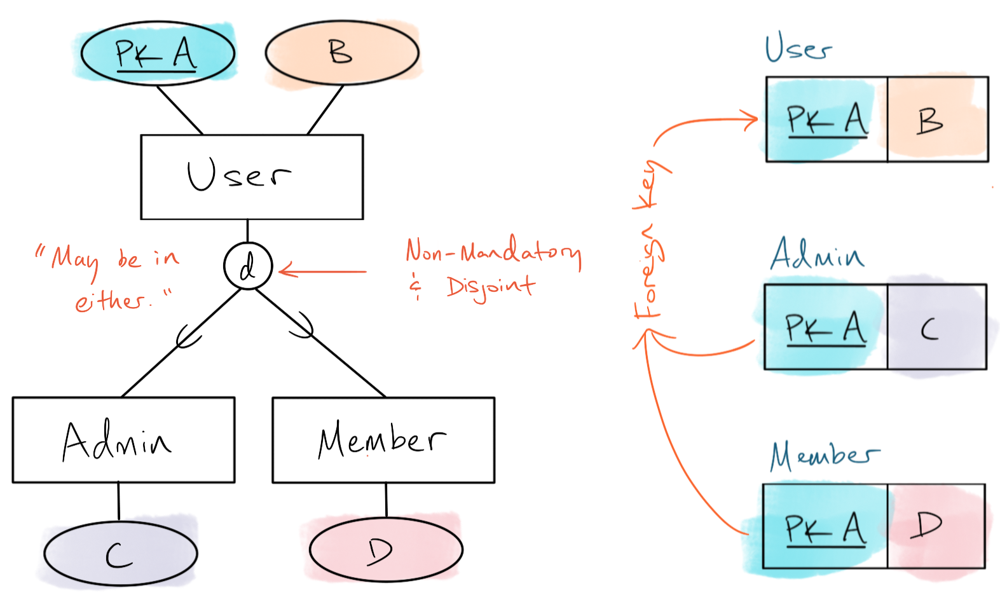

# Database Systems Concepts and Design

--8<-- "includes/abbr.md"

A database is a model of structures of reality.

## Database Management System

... is a software system allowing users to create and maintain a database.

When to use a DBMS:

- For data-intensive applications
- Persistent, centralized storage (centralized security, access policies)
- Controlling data redundancy (consistency, integrity)
- Multiple users
- Data sharing (communication)
- Documenting data via its structure
- Data independence allows modification without affecting UI
- Backup and recovery

When not to use:

- Cost-benefit isn't worthwhile
    - Investment in *ware, training is too high
    - Data and application is simple, stable
- The points above (security, concurrency for multiple users, recovery) aren't needed
- Real-time requirements can't be met with a DB

Characteristics of a DB approach:

- DB definition (metadata) is stored in the catalog
- NOSQL systems (no metadata) are self-describing
- Multiple different views of the database for different users
- Data access, transaction processing shared among users

## Process Modeling

- Fix and represent a perception of processes of reality
- Processes are not reflected in DB structures, but reflected in how data is used through the DBMS
- Processes can be represented by being embedded in program code
    - DML between UI and DB acts as an interface for retrieving and displaying data to the user
- ... or executed ad-hoc
    - DML is directly used to build and run queries, do maintenance, ad-hoc

## Data Modeling

- Select aspects of reality that are important to the model and use abstraction to organize them
- Examples of data models:
    - **Extended Entity Relationship** model is for fixing a perception of structures of reality
    - **Relational Model** represents this perception as tables in a DB, and each table can be stored as a separate file
    - **Object Model** defines a DB as objects, object properties and operations (methods) using classes organized in hierarchies (acyclic graphs)
        - Also **object-relational** or **extended relational systems**
    - **Key-value data model** where each value has a unique key
    - **Document data model** stores data as documents, based on JSON
    - **Graph data model** stores objects as graph nodes and relationships as directed graph edges
    - **Column-based data model** stores columns of rows clustered on disk pages
    - **XML model**, using hierarchal tree structures
    - **Hierarchical Model** was the first DB system implemented in the [IBM Information Management System (IMS)](https://en.wikipedia.org/wiki/IBM_Information_Management_System) (fundamental model of XML DBs today)

Data models consist of formalizations to express:

- Data structures
- Constraints
- Operations
- Keys and identifiers
- Integrity and consistency
- Null values
- Surrogates

Data model != a model of data. A data model:

- Is a type of data abstraction for conceptual representation
- Hides storage and granular implementation details

### Data Structures

A database **table** (with a name) has **columns** (with names and data types). Collectively, these constitute the **schema** of the table. The schema is stable over time and doesn't usually change.

The database also has **rows** with data in them. The rows and their data are the **state** of the database and reflect the reality modeled. The state is dynamic and changes over time.


### Constraints

Used to express rules that cannot be expressed by the data structure alone, for example:

- Uniqueness
- Cannot be NULL
- Minimum and maximum date, times, numbers
- Geographic restriction

### Operations

Used to support data change and retrieval. Involves:

- The method, or operation, e.g. INSERT
- Conditions

### Keys and Identifiers

Can be used as uniqueness constraints, for example using an email as a primary key. Primary keys are unique.

### Integrity and Consistency

**Integrity** is a measure of how well the database reflects reality. **Consistency** is a lack of internal conflicts in the DB's data.

For example, it makes maintenance and consistency harder if you:

- Have a column for a user's City, State, ZIP, and an additional column for the user's Address
- Separately store date of birth and age of a user

### NULL Values

NULL may mean that no information is available for this row and column. Unknown data represented by NULL is an acceptable situation.

If a NULL value instead means that this row and column in combination would be inapplicable (e.g. catch-all forms), the schema design is poor as it does not accurately reflect reality.

### Surrogates

An immutable, system-generated artificial identifier to represent an entity existing the real world in the DB.

- **Name-based representation**: a thing is known only by the data that comprises it
- **Surrogate-based representation**: a thing is identified with a system-generated ID that doesn't change even if its data changes

## Architecture: ANSI/SPARC 3-Level

A database has schema (intention, or types) and data (extension, or the data). Users query against the schema in order to retrieve data effectively and efficiently.

ANSI/SPARC 3-Level separates the schema from how data is physically organized into an *internal schema*. This *physical data independence* allows changing the way data is stored (changing the internal schema) without affecting how the application has to query it (changing the conceptual or external schema).

One or more *external schema* serves as a layer of abstraction for applications. This gives applications a stable API that talks to the *conceptual schema*, which in turn uses the *internal schema* to access the data.

- Internal schema: how the data is stored
- Conceptual schema: meaning of the data
- External schema: use of data

### Internal Schema

Describes how the information in the conceptual schema is physically stored to provide the best performance. For example, if users often query on `Email`, an index on `Email` would provide efficient performance. Additional indices can also increase efficiency.

Indexes are a list of the column, e.g. `Email`, and a pointer (PTR) to the row that contains the Email value.

### Physical Data Independence

How much the internal schema can change without affecting the conceptual schema.

### Conceptual Schema

Describes the general structural aspects of reality shown by the data, excluding time, data representation, physical organization, and access. For example, the `RegularUser` table has `Email`, `DOB`, `Name`, `Sex`, etc.

The conceptual schema does not offer information about how the data is displayed or accessed.

### Logical Data Independence

How much the conceptual schema can change without affecting the application(s) or external schema. Harder to achieve than physical data independence due to a tighter coupling between the external and conceptual schema.

### External Schema

Derives and describes data from part of a conceptual schema in a convenient form for the user or application. For example, a virtual table `create view FemaleUsers...` by conditionally selecting on `Sex`.

Virtual tables are views into the DB -- they don't really exist as tables.

## ANSI/SPARC DBMS Framework

Consists of two pieces: *query transformer* and *schema compiler*.

### Schema Compiler

The metadatabase stores definitions of the conceptual, external, and internal schemas.

- The 🧍 *enterprise administrator* defines a conceptual schema using the language in interface (1).
- The 🖥️ *conceptual schema processor* software verifies syntax and uses the language (2) to store that schema as metadata in the metadatabase.
- An 🧍 *application system administrator* uses the language in interface (3) and the conceptual schema and expresses an external schema definition in interface (4). Multiple external schema can be defined.
- An 🖥️ *external schema processor* software checks the external schema for correct syntax and to see that it is correctly and logically derived from the conceptual schema. It then stores the external schema definition in the metadatabase with interface (5).
- A 🧍 *database administrator* uses the language in interface (3) and the conceptual schema to define an internal schema with the language in interface (13).
- The 🖥️ *internal schema processor* software checks this internal schema definition for correct syntax and that it physically implements the conceptual schema. It then stores the internal schema definition in the metadatabase with interface (14).

### Query Transformer

- The 🧍 user expresses queries on the database using language interface (12), either using ad-hoc queries or through the application's program code (TODO prepared queries).
- An 🖥️ *external to conceptual schema transformer* uses the definitions for the external and conceptual schemas in the metadatabase (using interface (36)) to translate the user's queries into a form fit for the internal schema (using interface (31)).
- The 🖥️ *conceptual to internal schema transformer* reads the conceptual and internal schema definitions using interface (36) and translates the query from interface (31) through interface (30) to a form fit for the...
- 🖥️ *internal schema to storage transformer*, which reads the internal schema definition from the metadatabase (through interface (34)). This translates the query from one that works on the internal schema to one that works on the data itself (OS or DB calls interface (21)).

### Framework, more practically

- DBA staff write DDL statements that are compiled by the DDL compiler and stored in the metadatabase
- Users can write interactive queries that are compiled and optimized by the query compiler and query optimizer, respectively
    - This is then given as a DBA command to the runtime database processor
- Programmers write applications that have host language code with embedded DB access; when these go through a precompiler, the host language compiler and DML compiler create compiled transactions
    - Compiled transactions are sent to the DB and executed by the runtime DB processor
- A concurrency control subsystem ensures competing transactions on the DB are executed in order

## Metadata

Two types of metadata: system (critical to a DBMS) and business (critical in a data warehouse).

System metadata includes:

- Where data came from
- How data was changed
- How data is stored and mapped
- Who owns and who can access data
- Data usage history and statistics

Business metadata includes:

- What data are available and where it is located
- How to access the data
- What the data means
- Predefined reports and queries
- How current data are

## Database Application Development Methodology

Operates under some assumptions:

- Business processes are well-designed
- The documents (DB input and output), tasks, and system boundary are known
- We can design one DB schema that unifies all views
    - Difficulties include different interests, goals, power, and politics in the organization
    - Organizations need shared goals

Software Process typically includes:

- Business process design
- *Analysis
- *Specification
- *Design
- *Implementation
- Testing
- Operation
- Maintenance

**Unique for DB development*

DB design involves data first instead of software first.

- **Requirements collection and analysis**: ask questions of prospective users to document their **data requirements**
- Specify **functional requirements**, consisting of user-defined **operations** (**transactions**)
- **Conceptual design**: create a **conceptual schema** with a high-level data model
- **Logical design** (**data model mapping**): DB implementation using DBMS
- **Physical design**: specifies **internal storage** structures, organization, indexes, access paths


1. Analysis produces an *Information Flow Diagram*
2. Specification produces an *ER or EER Diagram*, and from that, *Tasks*
3. In Design, the ER Diagram is translated to a *Relational Schema* and the Tasks to *Abstract Code* (like SQL)
4. In Implementation, the Relational Schema becomes a specific DB implementation, and the Abstract Code a specific programming language

### Analysis: Information Flow Diagram

- Denotes input and output documents, tasks, and system boundary
- Shows (possible) information flow, *not* control flow of the program
    - Denote direction of flow (input or output) with arrows
- Never connect two documents or two tasks

### Specification

Outputs:

- EER Diagram
- Data Formats
- Constraints
- Task Decomposition

## Extended-Entity Relationship Model

ER diagram notation:


### Words Matter

and, or, not, must, may, always, never, sometimes, at least, at most, for some, for all, overlap, disjoint, exists, unique, single, multiple, type, instance, surrogate, value

- "any" of these options could be valid

### Entities

An **entity type** and **entity surrogate** is a time-invariant representation of something, e.g. a user. Their names must be unique.

### Properties

**Properties**, or **attributes**, describe entities.

**Composite properties** are composed (concat) of more than one part, e.g. `Name` is created with the component properties `FirstName` and `LastName`. Composite properties can be hierarchal.

**Simple** or **atomic** attributes are not decomposable.

An entity can have **single-valued property types,** e.g. an email or password.

**Multi-valued properties** contain many values, for example, a field `Interests` that holds many interest values.

**Identifying properties** or **key attributes**, e.g. an email, identifies a single entity instance. Key attributes may be composites, e.g. `Name`. An entity may have more than one key attribute (no primary key concept in ER).

Related attribute values give us **derived attributes** and **stored attributes**. A DOB is a stored attribute, and a person's age can be derived from it. Derived attributes are often counts.

DBs contain **entity types**: groups of entities (**entity collection** or **entity set**) that have the same attributes.

### Classes, Inheritance

**Supertype** and **subtype** (**superclass** *C* and **subclass** *S*) give us **class/subclass relationship types** (**is-a relationships**).

$$
\mathit{S}\subseteq\mathit{C}
$$

These place entities into non-exclusive subcategories. For example, `Users` may be `Male` or `Female`, `AdminUser` or `RegularUser`. Supertypes and subtypes inherit the properties of the base type, e.g. all types of users have an email. Supertypes and subtypes also have **local** properties specific to that type, e.g. `Female` users have `MaidenName`. Creating a superclass entity from previously separate entities is called **generalization** (**generalized entity type** *G*).

A **specialization** *Z* is a set of subclasses *S* with the same superclass, *G* (*G/Sᵢ*).

$$
\mathit{Z}=\{\mathit{S_1,S_2,...,S_n}\}
$$

*Z* is said to be total if:

$$
\cup_{\mathit{i=1}}^\mathit{n}\mathit{S_i}=\mathit{G}
$$

Otherwise it is partial.

**Predicate-defined** (**condition-defined**) subclasses, *S*, are defined by the **defining prediciate**, or a predicate *p* that is a constraint for that subclass. For example, a `Secretary` (*S*) is a predicate-defined subclass of the superclass `Employee` (*C*) where `JobType` (*p*) is `Secretary`.

$$
\mathit{S}=\mathit{C[p]}
$$

When this is the case for all subclasses, the superclass *C* is called an **attribute-defined specialization** with subclasses indicated by the **defining attribute**, *(A=cᵢ)*, where *cᵢ* is a constant value from the domain of *A*.

When subclasses are not defined with a condition, they are **user-defined**.

Designing classes from the generalization to the specializations is **top-down conceptual refinement**. Moving in the other direction is **bottom-up conceptual synthesis**.

**Union entity types** (**category** *T*) is a subclass of an entity union with another entity type (superclasses *D*).

$$
\mathit{T}\subseteq(\mathit{D_1}\cup\mathit{D_2}...\cup\mathit{D_n})
$$

For example, entities in the `PrivateSector` or the `PublicSector` can both be `Employer`s. There exist no `Employer` entities that are not either a `PrivateSector` or `PublicSector` employer. As well, the intersection between `PrivateSector` and `PublicSector` is empty; no `Employer` can be both.


Categories can also be total or partial and may have different key attributes (names), depending on the subclass.

### Tree and Lattice

A **tree structure** (**specialization** or **strict hierarchy**) constrains every subclass to have only one parent (**single inheritance** of attributes and relationships). In a **specialization lattice**, subclasses may have more than one class/subclass relationship.

Subclasses with more than one parent are **shared subclasses** (**multiple inheritance** of attributes and relationships); this implies a lattice.

A **leaf node** is a class without subclasses.

### Constraints

A **disjointness constraint** may apply to subclasses, where an entity can be a member of at most one subclass (can't be both). This includes attribute-defined specializations implicitly for single-value attributes. Specializations that **overlap** indicate that entities can be members of more than one subclass.


If neither of these constraints are indicated, subclasses are non-exclusive.

A **specialization** (subclass) *Z* is said to be disjoint if:

$$
\mathit{S_i}\cap\mathit{S_j}=\oslash
$$

for:

$$
\mathit{i}\ne\mathit{j}
$$

Otherwise it's overlapping. Both disjoint and overlapping constraints may be total or partial specializations.

A **totalness constraint** (**total specialization**, **total participation**, **existence dependency**) means every entity in the superclass must be a member in at least one subclass; i.e.  every entity in the total set is related to the other entity.


**Partial specialization** (**partial participation**) allows entities not to belong to any subclass; i.e. some or part of the set of entities are related to the other entity.

Relationships have **cardinality**, the maximum number of relationship instances an entity can participate in. Cardinality is expressed as a ratio. A relation with cardinality `1:1` is constrained as a **one-to-one relationship.** We also have **one-to-many relationships** (`1:N`) where one surrogate is linked to one or more other surrogates.

- `1`: maximum one
- `N` or `M`: "many," no maximum number

We may have **minimum cardinality constraints** as well.

### Relationships

A **mandatory one-to-many relationship** is constrained so that surrogates from group B (the `N` side) must be mapped to a surrogate in group A (relation cannot be null). When all surrogates in group B are mapped to one from group A, this is a **total function.** A **partial function** means that not all surrogates from group B are mapped to a surrogate from group A.

A **many-to-many relationship** (`M:N`) can have multiple surrogates from group A (the `N` side) associated with a particular surrogate in group B (the `M` side). Likewise, many surrogates from group B may be associated with a particular surrogate in group A. Any single element in either group may be mapped to multiple elements in the other group. This is not called a function, but a **relationship** in the mathematical sense.


Any composition of relationship types involving a `M:N` relationship or two `1:N` relationships is also `M:N`:

`A 1:N B` and `C M:N B` = `A M:N C`

`A 1:N B` and `C 1:N B` = `A M:N C`

As opposed to binary relationship types, **N-ary relationship types** are defined by combinations of entities, e.g. `Email` for a person, `EventName` for a type of event, and `TeamName` for a team for that event. The person, event, and team are all required to specify the `Position`. These exist as it is not always possible to decompose a conjunction of three relationships into binary relationships, e.g., you could not accurately specify a position without the person, event, or team in question.

**Weak entities** are identified by their **identifying relationship**, in which they always have total participation. For example, a `StatusUpdate` is uniquely identified by its `DateAndTime` (a **partial identifier** since it is not sufficient on its own to identify a unique `StatusUpdate`) as well as a `User`'s `Email`. `StatusUpdate` is a weak entity type since one cannot be uniquely found without the identifying relation to `Email` through `User`.

**Recursive** or **self-referencing relationships** relate the entity type to itself in different roles, for example, one `AdminUser` is the manager of another `AdminUser`. Directional arrows help diagram this relationship.

**Implicit relationships** exist whenever an attribute of one entity type refers to another entity type, e.g. an entity `Employee` has an attribute `Department` that refers to a particular `Department` entity.

Relationships are not entities and don't have properties.

- Move properties onto entities that keep the most granular detail, e.g. `EmployedSinceDate` onto `Employee` as opposed to `Employer`, where the one value would be the same for everyone.
- Create a "through" entity or **objectified relationship type**, e.g. a `User` can map to many `SchoolsAttended` (with property `GPA`). A `School` can map to many `SchoolsAttended` and this creates a many-to-many relationship between `User` and `School`.

Properties and entities are not necessarily consistent across databases. For example, `LastName` may be a property of `User` in one app. In another app it may be the central entity of a genealogy database, with properties for `Language`, `Era`, etc. Understanding the context is important.

## Relational Model

Each relation resembles a table of values; a *flat file* of records with a linear (flat) structure.

- Data structures
- Constraints
- Operations
    - Algebra
    - Calculus
        - Two notations: tuple calculus in SQL (tuples of relations are variables) and domain calculus in QBE (cells of domains are variables)

### Data Structures


**Degree** of a relationship type is its number of participating entities. Degree of two is **binary**, degree of three is **ternary**. A higher degree is more complex.

Values that are **atomic** are indivisible (formally, in the relational model).

A **domain**, *D*, is a set of atomic values (a type). Each simple attribute of an entity type has a domain of values (value set, or basic types, data types). These are not shown on basic ER diagrams.

An attribute *A* of entity set *E* with value set *V* defined as a function from *E* to the power set *P(V)* (set of all subsets of *V*):

$$
\mathit{A}:\mathit{E}\to\mathit{P}(\mathit{V})
$$

Value of attribute *A* for entity *e* is *A(e)*.

- Null values are represented by *empty set*
- For single-value attributes, *A(e)* is restricted to being a *singleton set*

For a composite attribute *A*, value set *V* is thw power set of the Cartesian product:

$$
\mathit{V}=\mathit{P}(\mathit{P}(\mathit{V_{1}})\times\mathit{P}(\mathit{V_{2}})\times...\times\mathit{P}(\mathit{V_{{n}}}))
$$

... where:

$$
\mathit{V_{i}},...,\mathit{V_{n}}
$$

... are the value sets of the simple component attributes for *A*.

A **relation schema** (or relation scheme, relation intension) consists of a relation name, *R,* and its list of attributes, *A1* ... *An*, and is denoted *R(A1, A2, ..., An)*. Each attribute is the name of a role of some domain *D*, i.e. a value of some data type. The domain of any attribute is **dom(*Ai*)**. The **degree** or **arity** of a relation is the number of attributes it has.

```sql
STUDENT(Name, ID, Phone_number, Address)
```

A **relation**, *r* of the relation schema, is a set of tuples. (In a set, elements are distinct; mathematically, they are unordered.) Also **relation state**, this can be denoted *r(R)*.

The relation schema can be interpreted as a **declaration**, an **assertion**, or as a **predicate**, and each tuple interpreted as a **fact** or particular **instance** of the assertion, or as values that *satisfy* the predicate. Relations may represent facts about entities or relationships.

The **closed world assumption** states that the only true facts in the universe are those present within the extension (state) of the relation(s) .

#### Two Ways to Define Relation

Where a *n*-tuple is an ordered list of *n* values (the order of the values in the tuple is important):

> A relation (or relation state) *r(R)* is a mathematical relation of degree *n* on the domains dom(A1), dom(A2), ..., dom(An), which is a subset of the Cartesian product (denoted by x) of the domains that define R:
> $$
> \mathit{r(R)} \subseteq (dom(A_{1}) \times dom(A_{2}) \times ... \times dom(A_{n}))
> $$

Alternatively, where tuples are defined as mappings and considered a set of (attribute, value) pairs. In this case the ordering of attributes is not important since the attribute name appears with its value (**self-describing data**):

A **relationship type**, *R*, defines a set of associations (**relationship set**) among entities from entity types *participating* in *R*. Each individual entity participates in the relationship instance:

$$
\mathit{r_{i}}=(\mathit{e_{1}},\mathit{e_{2}},...,\mathit{e_{n}},)
$$

*R* is a subset of the set of ordered n-tuples:

$$
\mathit{R}\subseteq\{<\mathit{d}_{1},\mathit{d}_{2},...,\mathit{d}_{n}>|\mathit{d}_{i}\in\mathit{D}_{i},\mathit{i}\=\mathit{1},...,\mathit{n}\}
$$

This means that each element in the tuple,

$$
\mathit{d}_{i}
$$

is pulled from the corresponding domain

$$
\mathit{D}_{i}
$$

An **attribute**, `A`, is a unique name given to a domain in a relation and is used instead of referring to the position of a column in a table. The order of attributes and tuples is independent of what the value of the current relation is.

### Relational Databases and their Schemas

A **relational database schema** *S* is a set of relation schemas:

$$
\mathit{S} = \{\mathit{R}_{1}, \mathit{R}_{2}, ..., \mathit{R}_{m}\}
$$

... and a set of **integrity constraints** *IC*.

A **relational database state** *DB* of *S* is a set of relation states:

$$
DB = \{\mathit{r}_{1},\mathit{r}_{2}, ..., \mathit{r}_{m}\}
$$

... such that each *rᵢ* is a state of *Rᵢ*; and the *rᵢ* relation states satisfy the IC. Whether a state obeys its IC is called **valid state** or **not valid**.

A "relational database" implies both its schema and current state.

### Constraints

**State constraints** (static constraints) define constraints that a valid state of the database must satisfy. **Transition constraints** (dynamic constraints) can be defined to deal with state changes in the database and are typically enforced by the application.

**Inherent model-based constraints** or **implicit constraints** are, go figure, inherent in the data model.

**Schema-based constraints** or **explicit constraints** can be directly expressed in the schemas of the data model, e.g. specifying them in the DDL. They include:

#### Domain Constraints

The value of each attribute within a tuple must be an atomic value from the domain.

Violated if an attribute value does not appear in the corresponding domain (is the wrong data type).

#### Key constraints

A **uniqueness constraint** states that no two tuples in a relation can be the same and also applies to superkeys. Where *SK* is a **superkey** of *R*:

$$
\mathit{t}_{1}[SK]\ne\mathit{t}_{2}[SK]
$$

- The default superkey is the set of all a relation's attributes, which can include redundancy
- A **key** *k* has no redundancy and satisfies both *uniqueness property* and *minimality property*
- If you remove any attribute from *K*, you leave a set of attributes *K'* that is no longer a superkey of *R*
- A *minimal superkey* cannot have any attributes removed and still have its uniqueness hold
    - This *minimality property* is required for a key but optional for a superkey
- A key with multiple attributes requires all its attributes together to have uniqueness
- A key is a superkey, but not vice versa; i.e. only a minimal superkey is a key (e.g. superkey with a single attribute)
- A key's set of attributes is a property of the relation schema and should hold on every valid relation state of the schema
- The property of a key is *time-invariant* and must hold when new tuples are inserted (i.e.`Name` is a poor key because two people can have the same name)
- A relation schema may have more than one **candidate key**, and one may be designated as the **primary key**; the other candidates are designated **unique keys**

Violated if a new key value already exists in another tuple in the relation.

#### Constraints on NULLs

NULL values have several different meanings:

- Value unknown
- Value exists but is not available, or is withheld
- Not applicable attribute (or value undefined)

Whether NULL values are permitted for the attribute.

#### Entity Integrity Constraints

States that no primary key value can be NULL. Violated if any part of the PK is NULL.

#### Referential Integrity Constraints

Specified between two relations; maintains consistency among tuples in both. A tuple in one relation that refers to another relation must refer to an existing tuple (no orphans). Specified on the relational database schema so the DBMS can enforce these constraints on the database states; defined via the DDL.

Conditions for a foreign key specify a referential integrity constraint between *R₁* (the **referencing relation**) and *R₂* (the **referenced relation**). *FK* is a set of attributes in the relation schema *R₁* that *reference* or *refer to* the relation *R₂*.

- FK attributes have the same domain(s) as the PK of the relation it references
- The value of any FK either occurs as a value of PK for the tuple it refers to, or it is NULL:

    $$
    t_{1}[FK] = t_{2}[PK]
    $$

- If these two conditions hold, the referential integrity constraint from *R₁* to *R₂* is said to hold.
- A FK can refer to its own relation, e.g. EMPLOYEE has a Supervisor_ID which is another EMPLOYEE.

These are diagrammed with directed arcs where the arrowhead points to the PK of the referenced relation.

FKs reference **primary keys** (PK):

- Unique and must not be NULL, e.g. emails for `User`s
- When used in another table, e.g. `RegularUser`, the set of PKs that appear in `RegularUser` must be a subset of the values from the `User` table

Violated if the value of any FK refers to a tuple that does not exist in the referenced relation.

#### Semantic Constraints

**Application-based** or **semantic constraints** or **business rules** cannot be expressed in the schemas of the data model and must be programmed into application logic. Sometimes they can be specified as **assertions** in SQL using triggers and assertions (constraint specification language).

**Data dependencies** (functional, multivalued dependencies) are used for testing the design of a relational database and are utilized in *normalization*.

### Update Operations, Transactions, Handling Constraint Violations

Operations are either *retrievals* or *updates*. Retrievals are specified by relational algebra operations and answer the user's query with a **result relation**.

Database **modification** or **update** operations change the states of relations in the database.

#### Insert

Provides a list of attribute values for a new tuple *t* to be inserted into a relation *R*. If the insertion violates any constraint, the default option is to reject it.

Alternatively an attempt may be made to correct the reason for rejecting the insertion: e.g. please provide a value for a non-nullable field, or please provide a value for the referenced relation if none exists before accepting a PK. This is not typically used for violations caused by Insert (a violation could cascade).

#### Delete

Can only violate referential integrity if the tuple being deleted is referenced by a FK elsewhere in the DB.

If a violation occurs, options include:

- Restrict: reject the deletion
- Cascade: propagate the deletion by deleting tuples that reference the tuple being deleted
- Set null or set default: modify the referencing attribute values, e.g. set these to NULL or a default
    - If the referencing attribute is part of a PK, it cannot be set to NULL
- It's also possible to combine these three

#### Update

An **Update** or **Modify** is used to change the values of one or more attributes in tuple(s). If the updated attribute is not part of a PK or FK, no violations are usual. If it is, modification is similar to delete + insert and is dealt with similarly.

#### Transaction

A **transaction** is the executing program that includes database operations, e.g. reading, insertions, deletions, updates. Upon finishing, a transaction must leave the DB in a valid state (consistent state) that satisfies all constraints.

Any number of retrieval and update operations form an atomic unit of work against the DB.

## SQL

Structured Query Language (from Structured English QUEry Language, SEQUEL) provides a higher-level (than relational algebra operations) declarative language interface; i.e. the user specifies what the result should be, and optimization and execution is left up to the DBMS. SQL is based on tuple relational calculus, some algebra.

- Part of System R, 1973
- ANSI & ISO Standards
    - SQL/86, SQL/89
    - SQL/92 or SQL2
    - SQL3, 1999
    - Revisions: 2003, 2006, 2008, 2011
- Supported by IBM, DB2, Oracle, SYBASE, SQLServer, MySQL

A **core** specification is supposed to be implemented by SQL compliant RDBMS vendors; specialized **extensions** can be implemented as optional modules.

Terms (SQL: formal relational model)

- **table**: relation
- **row**: tuple
- **column**: attribute

### Schema and Catalog

A **SQL schema** is identified by a **schema name**; an **authorization identifier**, indicating the user/account who owns the schema; and **descriptors** for each element in the schema (tables, types, constraints, views, domains, authorization grants, etc).

A **catalog** is a named collection of schemas (also, a cluster of catalogs). It contains a special INFORMATION_SCHEMA that provides information on all schemas in the catalog and element descriptors in those schemas.

- Integrity constraints (e.g. referential integrity) can be defined between relations only if they exist in schemas within the same catalog
- Schemas in the same catalog can share certain elements, e.g. type, domain definitions

SQL keywords are not case-sensitive.

### Attribute Data Types, Domains

#### Numeric

Includes:

- INTEGER or INT, SMALLINT
- Floating-point (real) numbers FLOAT or REAL, DOUBLE PRECISION
- Formatted numbers DECIMAL(*i,j*) or DEC(*i,j*) or NUMERIC(*i,j*)
    - Where *i* is precision (total number of decimal digits, default is implementation-defined) and *j* is scale (number of digits after decimal point, default 0)

#### Character-string

Includes:

- Fixed length CHAR(*n*) or CHARACTER(*n*)
    - Shorter strings are padded with blank characters to the right
    - Padded blanks are generally ignored when comparing strings
- Varying length VARCHAR(*n*) or CHAR VARYING(*n*) or CHARACTER VARYING(*n*) with maximum *n*
    - CHARACTER LARGE OBJECT (CLOB) maximum length can be specified in kilobytes (K), megabytes (M), gigabytes (G); e.g. `CLOB(20M)`

Strings are:

- Ordered in alphabetic (lexicographic) order; those that appear first are considered less than those appearing later
    - Nonalphabetic characters have a defined order
- Concatenated with `||`

Single quotes enclose literal string values that are case-sensitive.

#### Bit-string

Includes:

- Fixed length BIT(n)
- Varying length BIT VARYING(n) with maximum *n*
    - BINARY LARGE OBJECT or BLOB maximum length can be specified in kilobytes (K), megabytes (M), gigabytes (G); e.g. `BLOB(20G)`

Default length for *n* is 1.

Literal bit strings are enclosed by single quotes preceded with a `B`: `B'10101'`. Hexadecimal notation can be used for bit strings with multiple of 4, preceded by `X` instead.

#### Boolean

TRUE or FALSE with third possible value UNKNOWN.

#### DATE and TIME

- DATE has ten positions for YEAR, MONTH, DAY as YYYY-MM-DD. Values must be valid.
- TIME has at least eight positions for HOUR, MINUTE, SECOND as HH:MM:SS. Values must be valid.
    - TIME(*i*) allows specifying *i* which is *time fractional seconds precision*
        - Specify *i* + 1 additional positions (additional period as separation character), and *i* positions for decimal fractions of a second
    - TIME WITH TIME ZONE includes additional six positions for specifying displacement from standard universal time zone: `+13:00` to `-12:59` (HOURS:MINUTES)
        - Default without WITH TIME ZONE is the local SQL session time zone

Both can be compared with `<` and `>`. Earlier dates and times are considered smaller.

Literal values are strings enclosed by single quotes and preceded with DATE or TIME: e.g. `DATE '2021-06-22'`, `TIME '11:54:12'`.

TIMESTAMP includes DATE and TIME fields, plus minimum six positions for decimal fractions of seconds and optional WITH TIME ZONE qualifier. Literal values are preceded by TIMESTAMP: `TIMESTAMP '2021-06-22 11:54:12.421345'`.

INTERVAL specifies a *relative value* that can be used to increment/decrement an absolute value (date, time, timestamp). Qualified as either YEAR/MONTH or DAY/TIME.

DATE, TIME, TIMESTAMP can be *cast* or *coerced* into equivalent strings for comparison.

## SQL Create

### CREATE SCHEMA

- Create a schema with all its definitions, or just name and authorization identifier (with the rest to be provided later), e.g.:

```sql
CREATE SCHEMA COMPANY AUTHORIZATION 'Jsmith';
```

### CREATE TABLE

- Create a **base table** (new **base relation**; created and stored as a file by the DBMS) with a name, its attributes, and initial constraints
- Key, entity integrity, and referential integrity constraints can be specified in this statement or added later with ALTER TABLE

```sql
CREATE TABLE EMPLOYEE
```

Above, the schema is implicit; it can also be explicit:

```sql
CREATE TABLE COMPANY.EMPLOYEE
```

Full example:

```sql
CREATE TABLE DEPARTMENT
(
    Dname VARCHAR(15) NOT NULL,
    Dnumber INT NOT NULL,
    Manager CHAR(9) NOT NULL DEFAULT '123456789',
    CONSTRAINT DEPTPK
    PRIMARY KEY (Dnumber),
    UNIQUE (Dname),
    FOREIGN KEY (Manager) REFERENCES EMPLOYEE(Ssn)
    ON DELETE SET DEFAULT ON UPDATE CASCADE
);
```

Attributes are considered to be ordered in the sequence in which they are specified, but rows are not considered to be ordered in a table.

### CREATE VIEW

Create a **virtual relation** (view) which may or may not correspond to a physical file.

### CREATE DOMAIN

Data type can be directly specified for an attribute. Alternatively, declare a domain (abstraction layer) e.g. for SSN_TYPE:

```sql
CREATE DOMAIN SSN_TYPE AS CHAR(9);
```

Then use SSN_TYPE in place of CHAR(9) later.

### CREATE TYPE

Creates user-defined types (UDT).

## Constraints in SQL

With CREATE you can specify CONSTRAINT, e.g. `NOT NULL`

... and DEFAULT, e.g. `DEFAULT 1`

- Included whenever an explicit value is not specified
- If unspecified, is NULL unless there is a NOT NULL constraint

The CHECK clause follows an attribute or domain definition and can specify constraint, e.g. restrict to integer between 1 and 20:

```sql
CREATE DOMAIN D_NUM AS INTEGER CHECK (D_NUM > 0 AND D_NUM < 21);
```

CHECK also specifies table constraints at the end of the CREATE TABLE statement called **row-based** constraints, which apply individually to each row. These are checked when a row is inserted or modified.

```sql
CHECK (Dept_create_date <= Manager_start_date);
```

### Key and Referential Integrity Constraints

For PK with a single attribute, can be specified following the attribute and domain:

```sql
Dnumber INT PRIMARY KEY;
```

UNIQUE can also be specified this way if it is a single attribute:

```sql
Dname VARCHAR(15) UNIQUE;
```

Referential integrity is specified with the FOREIGN KEY clause. A **referential triggered action** clause may be added with options:

- SET NULL
- CASCADE
    - Delete all referencing tuples or update value of all referencing FK attributes
    - Generally suitable for relationship relations, relations that represent multivalue attributes, and relations that represent weak entity types
- SET DEFAULT

...qualified with one of:

- ON DELETE
- ON UPDATE

Constraints can be optionally named, following the CONSTRAINT keyword.

## SQL Retrieval Queries

The SELECT statement (different from SELECT operation in relational algebra) retrieves information from the DB.

A SQL table is not a *set* of tuples (in a set, all members are unique); it is a **multiset**, or bag of tuples. A SQL relation *may be* constrained to be sets, e.g. when DISTINCT is used with SELECT.

Basic form is called **mapping** or **select-from-where block**:

```sql
SELECT <attribute list>     -- attribute names for values you want to retrieve
FROM <table list>           -- relation names
WHERE <condition>;          -- Boolean expression to identify tuples to be retrieved
```

Only SELECT and FROM are mandatory.

A query *selects* the relation's tuples that satisfy (evaluates to TRUE) the Boolean WHERE condition (**selection condition** in relational algebra) and *projects* the result on the attributes listed in the SELECT clause, which specifies the attributes whose values to retrieve (**projection attributes** in relational algebra).

An implicit **tuple variable** is thought to iterate in the SQL query, looping over each tuple to evaluate the condition and return those for which it evaluates to TRUE.

In WHERE, any number of **selection conditions** can choose a particular tuple (`Dname = 'Research'`); any number of **join conditions** can combine tuples from more than one relation (`Dnumber` from DEPARTMENT = `Dno` from EMPLOYEE):

```sql
SELECT Fname, Lname, Address
FROM EMPLOYEE, DEPARTMENT
WHERE Dname = 'Research' AND Dnumber = Dno;
```

A **select-project-join** query has only selection and join conditions plus projection attributes. Each tuple in the result is a combination of one of each of the joined tuples.

### Logical Comparison Operators

| lanuage            | equal | less than | less than or equal | greater than | greater than or equal | not equal |
| ------------------ | ----- | --------- | ------------------ | ------------ | --------------------- | --------- |
| SQL                | =     | <         | <=                 | >            | >=                    | <>        |
| relational algebra | =     | <         | ≤                  | >            | ≥                     | ≠         |
| C/C++              | =     | <         | <=                 | >            | >=                    | !=        |

### Renaming, Tuple Variables

Attributes in different tables can have the same name; we sometimes need to **qualify** the attribute name with the relation name to prevent ambiguity. Use fully qualified attribute names: prefix the attribute name with the relation name, separated by a period.

```sql
SELECT Fname, EMPLOYEE.Name, Address
FROM EMPLOYEE, DEPARTMENT
WHERE DEPARTMENT.Name = 'Research' AND DEPARTMENT.Dnumber = EMPLOYEE.Dnumber;
```

Use an **alias** or **tuple variable** to give a shorthand to long relation names, or make relations that appear twice more understandable:

```sql
SELECT E.Fname, E.Lname, S.Fname, S.Lname
FROM EMPLOYEE AS E, EMPLOYEE AS S
WHERE E.Super_ssn = S.Ssn;
```

This creates two copies of the EMPLOYEE relation that can now be joined (one-level recursive query).

Aliases can also directly follow the relation name: `FROM EMPLOYEE E`. Relation attributes can be renamed within the query with aliases:

```sql
FROM EMPLOYEE AS E(Fn, Ln)
```

Results can also be renamed:

```sql
SELECT E.Lname AS Employee_name, S.Lname AS Supervisor_name
FROM EMPLOYEE AS E, EMPLOYEE AS S
WHERE E.Ssn = S.Ssn;
```

### Unspecified WHERE, Asterisk

A missing WHERE clause selects all tuples from the specified relation; if more than one relation is specified in FROM, the CROSS PRODUCT (all possible tuple combinations) is selected. This can inadvertently select very large relations.

To intentionally retrieve all attribute values, specify an asterisk, optionally prefixed with the relation name or alias, e.g. `EMPLOYEE*`.

### Duplicates, DISTINCT

- Since SQL treats a table as a multiset, duplicates are not eliminated from query results by default; can also do this explicitly with `SELECT ALL`
- A SQL table with a key is restricted to being a set, since the key must be distinct in each tuple

To eliminate duplicates from the results, use DISTINCT in the SELECT clause:

```sql
SELECT DISTINCT Salary
FROM EMPLOYEE;
```

or

```sql
SELECT DISTINCT(Attribute)
FROM RegularUser;
```

### Set Operations

The relational-algebra-equivalent set operations result in sets of tuples (distinct) and apply only to type-compatible relations.

Corresponding multiset operations (not distinct) are followed by ALL, e.g. UNION ALL.

#### UNION: set union

Returns all cities from CurrentCity and HomeTown columns.

```sql
SELECT CurrentCity
FROM RegularUser
UNION
SELECT HomeTown
FROM RegularUser;
```

#### EXCEPT: set difference, also MINUS

Give all CurrentCities except those that are someone's HomeTown.

```sql
SELECT CurrentCity
FROM RegularUser
EXCEPT
SELECT HomeTown
FROM RegularUser;
```

EXCEPT ALL to return cities if they appear more times as CurrentCities than as HomeTown; i.e. include it in results if it is a duplicate.

#### INTERSECT: set intersection

Returns distinct cities that are someone's CurrentCity and someone's HomeTown.

```sql
SELECT CurrentCity
FROM RegularUser
INTERSECT
SELECT HomeTown
FROM RegularUser
```

INTERSECT ALL to include duplicates.

### Pattern Matching

The LIKE comparison operator can be used for string pattern matching. The `%` reserved character replaces an arbitrary number of 0 or more characters (anything), and `_` replaces a single character.

```sql
SELECT Fname, Lname
FROM EMPLOYEE
WHERE Address LIKE '%Houston,%TX%';
-- or
WHERE Bdate LIKE '____06__'; -- June birthdays
```

#### Literal Characters

- Specify an escape character with ESCAPE: `'A\_BC' ESCAPE '\'` gives a literal `_`.
- For `'`, use `''`.

### Operators

Arithmetic can be applied to numeric values or attributes (numeric domains): `+`, `-`, `*`, `/`

```sql
SELECT E.Fname, E.Lname, 1.1 * E.Salary AS Raise
FROM EMPLOYEE AS E
...
```

Strings can be concatenated with `||`.

Date, time, timestamp, and interval data types can be incremented (`+`) or decremented (`-`) by an interval.

### Comparison Operators

- BETWEEN is equivalent to `(Thing >= INT) AND (Thing <= INT)`.
- IN compares a value *v* with a set or multiset of values *V* and is TRUE if *v* is an element of *V*.

### Ordering, or Sorting

Use ORDER BY, optionally with DESC or ASC: `ORDER BY D.Dname DESC, E.Lname ASC, E.Fname ASC;`

Default is ascending order of values.

## Modification: INSERT, DELETE, UPDATE

INSERT adds a single row to the table given a relation name and list of values listed in the same order as the attributes:

```sql
INSERT INTO EMPLOYEE
-- or specify attribute names, as long as all NOT NULL are included
INSERT INTO EMPLOYEE(Fname, Lname, Phone)
VALUES ('Jim', 'Bob', '1235559999');
```

Insert multiple tuples, separated by commas, by enclosing the attributes for each in parenthesis.

Insert multiple rows if the insertion contains a query expression that identifies some data from the DB and inserts it in one of the DB tables.

Create a temporary table by combining CREATE TABLE NEW_TABLE with INSERT INTO NEW_TABLE; values here may not remain updated (use a view for this instead). Later, remember to DROP TABLE.

Create a similar table to an existing one (same attributes) using existing data (WITH DATA) with LIKE:

```sql
CREATE TABLE W9EMP LIKE EMPLOYEE
(SELECT E.*
FROM EMPLOYEE AS E
WHERE E.Status = 'W9') WITH DATA;
```

DELETE removes tuples from a relation and can be used with WHERE. If WHERE is missing, all tuples are to be deleted, but the table remains until you DROP TABLE. Can delete a set of rows.

UPDATE modifies attribute values in a single relation. The SET clause specifies the attributes to be modified, and new values, e.g. to update Project 10:

```sql
UPDATE PROJECT
SET Plocation = 'Bellaire', Pmanager = 5
WHERE Pnumber = 10;
```

## SQL Access

GRANT and REVOKE can modify privileges for specific statements on certain relations.

## NULL Logic

Any NULL value is considered to be distinct from any other NULL (can't use `=`); when compared, the result is considered UNKNOWN and may be TRUE or FALSE. Three-value logic is used:

| AND     | TRUE    | FALSE | UNKNOWN |
| ------- | ------- | ----- | ------- |
| TRUE    | TRUE    | FALSE | UNKNOWN |
| FALSE   | FALSE   | FALSE | FALSE   |
| UNKNOWN | UNKNOWN | FALSE | UNKNOWN |

| OR      | TRUE | FALSE   | UNKNOWN |
| ------- | ---- | ------- | ------- |
| TRUE    | TRUE | TRUE    | TRUE    |
| FALSE   | TRUE | FALSE   | UNKNOWN |
| UNKNOWN | TRUE | UNKNOWN | UNKNOWN |

| NOT     |         |
| ------- | ------- |
| TRUE    | FALSE   |
| FALSE   | TRUE    |
| UNKNOWN | UNKNOWN |

Compare using the IS or IS NOT operator:

```sql
SELECT Fname, Lname
FROM EMPLOYEE
WHERE Ssn IS NULL;
```

## Nested Queries

Complete select-from-where blocks within another SQL query (**outer query**); can appear in the WHERE, FROM, or SELECT clauses.

```sql
SELECT DISTINCT Pnumber
FROM PROJECT
WHERE Pnumber IN
(SELECT Pnumber
    FROM PROJECT, DEPARTMENT, EMPLOYEE
    WHERE Dnum = Dnumber AND
        Manager = Ssn AND Lname = 'Smith')

    OR
    Pnumber IN
(SELECT Pno
    FROM WORKS_ON, EMPLOYEE
    WHERE Employer = Ssn AND Lname = 'Smith');
```

- Returns a **scalar** (single value) if result is a single attribute *and* a single tuple; can use `=` in this case
- Usually returns a table (relation: set or multiset of tuples)

### Comparing Nested Queries

Tuples can be used in comparisons, using parenthesis:

```sql
SELECT DISTINCT Essn
FROM WORKS_ON
WHERE (Pno, Hours) IN (SELECT Pno, Hours
                        FROM WORKS_ON
                        WHERE Essn = '56');
```

To compare a single value *v* with a set or multiset *V*:

- ANY or SOME is equivalent to IN
    - Can be combined with operators: `= ANY`, `> SOME`, etc
- ALL returns true if all the values in the set are true for the operator

```sql
SELECT Lname, Fname
FROM EMPLOYEE
WHERE Salary > ALL (SELECT Salary
                    FROM EMPLOYEE
                    WHERE Dno = 5);
```

A reference to an unqualified attribute refers to the relation declared in the innermost nested query. Generally, create aliases for all tables referenced in a query to avoid ambiguity from same attribute names.

### Correlated Nested Queries

When a condition in the WHERE clause references an attribute of a relation declared in the outer query, the two queries are **correlated**. The nested query is evaluated once for each tuple in the outer query.

E.g. Find Email and BirthYear of RegularUsers who have no Interests.

```sql
SELECT R.Email, BirthYear
FROM RegularUser R
WHERE NOT EXIST
    (SELECT *
    FROM UserInterests U
    WHERE U.Email = R.Email);
```

A query written with nested select-from-where blocks and using `=` or IN can always be expressed as a single block query instead.

### Functions

#### UNIQUE

Returns TRUE if there are no duplicate tuples in the result; otherwise FALSE.

#### EXISTS and NOT EXISTS

Boolean functions that return TRUE or FALSE; can be used in WHERE clause.

EXISTS checks if the result of a nested query is empty; is FALSE if it is empty, and TRUE if it contains at least one tuple.

```sql
SELECT E.Fname, E.Lname
FROM EMPLOYEE AS E
WHERE EXISTS (SELECT *
                FROM DEPENDENT AS D
                WHERE E.Ssn = D.Essn); -- True if there is at least one tuple
```

There's also NOT EXISTS (sort of like "does not have"). Typically used with a correlated nested query.

```sql
SELECT Fname, Lname
FROM EMPLOYEE
WHERE NOT EXISTS (SELECT *
                    FROM DEPENDENT
                    WHERE Ssn = Essn); -- If this evalues to true (none exist) the EMPLOYEE tuple is returned
```

### Explicit Sets

An **explicit set of values** can be used in the WHERE clause rather than a nested query ("hard coding").

```sql
SELECT DISTINCT Essn
FROM WORKS_ON
WHERE Pno IN (1,2,3);
```

### Joined Tables

A table resulting from a join operation in the FROM clause; may be easier to specify than a complex WHERE clause. Defaults to **inner join**.

```sql
SELECT Fname, Lname, EAddress
FROM (EMPLOYEE JOIN DEPARTMENT ON Dno = Dnumber)
WHERE Dname = 'Research';
```

Above returns a single joined table with all the attributes of the EMPLOYEE table followed by all those of the DEPARTMENT table.

NATURAL JOIN does not specify any join condition:

- Defaults to a Cartesian Product if there are no same named attributes in the two relations
- Implicit EQUIJOIN condition for **each pair of attributes with the same name** is created and each pair is included once in the result
- If the attribute names don't match, they can be renamed to match before applying NATURAL JOIN

Join types:

- JOIN or INNER JOIN: only pairs of tuples that match the join condition are retrieved
- OUTER JOIN: can be used to explicitly include all tuples
    - LEFT OUTER JOIN (`+=`): include every tuple in the left table in the result; right table padded with NULL values
    - RIGHT OUTER JOIN (`=+`): include every tuple in the right table in the result; left table padded with NULL values
    - FULL OUTER JOIN (`+=+`)
    - Can also leave off OUTER keyword
- Can specify the natural join variation: e.g. NATURAL LEFT OUTER JOIN
- CROSS JOIN: specifies CARTESIAN PRODUCT operation (all possible tuple combinations)

Joins can be nested (**multiway join**):

```sql
SELECT Pnumber, Dnum, Lname, Bdate
FROM ((PROJECT JOIN DEPARTMENT ON Dnum = Dnumber)
JOIN EMPLOYEE ON Manager = Ssn)
WHERE Plocation = 'Stafford';
```

Natural inner join with dot notation:

```sql
SELECT Email, RegularUser.BirthYear, Salary
FROM RegularUser, YearSalary
WHERE RegularUser.BirthYear = YearSalary.BirthYear;
```

...is the same as

```sql
SELECT Email, RegularUser.BirthYear, Salary
FROM RegularUser NATURAL JOIN YearSalary;
```

where we don't have to specify the join condition.

### Aggregate Functions

- Built-in functions
- Summarize information from multiple tuples into a single-tuple summary
- Subgroups are made using **grouping** before summarization
- Excludes NULL values when applied to a collection of values; an empty collection returns NULL (COUNT returns 0)

Functions are used in SELECT or HAVING clauses and include:

- COUNT: return the number of tuples or values resulting from the query
    - E.g. COUNT(*) returns number of rows (tuples) resulting from the query
    - COUNT(Salary) returns number of salary values in the DB (NULL values discarded)
    - COUNT(DISTINCT Salary) returns number of distinct salary values in DB (NULL values discarded)
- SUM
- MAX
- MIN
- AVG (mean)

These can be applied to nonnumeric domains that have total ordering, e.g. DATE, TIME, TIMESTAMP.

```sql
SELECT SUM(Salary), MAX(Salary), MIN(Salary), AVG(Salary)
FROM EMPLOYEE;
```

SOME or ALL can be applied to Boolean values; TRUE is returned if the condition is true for SOME or ALL elements.

### Grouping

Apply aggregate functions to a subgroup of tuples (**partition** the relation into exclusive subsets or **groups** using **grouping attributes**).

GROUP BY specifies grouping attributes that appear in the SELECT clause; the value resulting from the aggregate function appears with the value of the grouping attribute.

```sql
SELECT Dno, COUNT(*), AVG(Salary) -- List for each department
FROM EMPLOYEE
GROUP BY Dno;   -- Results are grouped by department no. before the aggregate functions are applied
```

A **separate group** is created for NULL value tuples in the grouping attribute.

When used with a join condition, grouping and aggregation is applied after the joining in WHERE clause.

HAVING applies conditions whereby only the groups that satisfy it are retrieved in the results:

```sql
SELECT Pnumber, Pname, COUNT(*)
FROM PROJECT, WORKS_ON
WHERE Pnumber = Pno -- join condition (project number)
GROUP BY Pnumber, Pname
HAVING COUNT(*) > 2; -- only return results for projects with more than two employee rows in the table
```

Execution order: WHERE, then HAVING.

### WITH

A user-defined temporary table that is used once for a particular query; convenience method.

```sql
WITH BIGDEPTS (Dno) AS (
    SELECT Dno
    FROM EMPLOYEE
    GROUP BY Dno
    HAVING COUNT (*) >5;
)
SELECT Dno, COUNT(*)
FROM EMPLOYEE
WHERE Salary > 40000 AND Dno IN BIGDEPTS
GROUP BY Dno;
```

### CASE

A case switch.

```sql
UPDATE EMPLOYEE
SET Salary =
CASE WHEN Dno = 5 THEN Salary +2000
     WHEN Dno = 4 THEN Salary +1500
     ELSE Salary + 0;
```

Useful for inserting tuples where different attributes may be NULL.

### Recursive Queries

Employee and Supervisor (both rows in the EMPLOYEE table) is an example of a **recursive relationship**. A recursive operation could retrieve all supervisees of a Supervisor at all levels.

```sql
WITH RECURSIVE SUP_EMP (SupSsn, EmpSsn) AS  -- defines a view SUP_EMP to hold result
(SELECT SupervisorSsn, Ssn
FROM EMPLOYEE                               -- base query loads the first level
UNION                                       -- combines each successive level
SELECT E.Ssn, S.SupSsn                      -- selects this level's supervisor
FROM EMPLOYEE AS E, SUP_EMP AS S
WHERE E.SupervisorSsn = S.EmpSsn)
SELECT*                                     -- return everything from SUP_EMP
FROM SUP_EMP;
```

Above will query recursively, combining the results with previous levels (UNION), until a **fixed point** is reached, when all the results are in the view.

## SQL Assertions

General constraints can be specified with **declarative assertions** using CREATE ASSERTION and giving it a name:

```sql
CREATE ASSERTION SALARY_CONSTRAINT
CHECK
(NOT EXISTS
(SELECT *
FROM EMPLOYEE E, EMPLOYEE M, DEPARTMENT D
WHERE E.Salary>M.Salary -- Employee salary cannot exceed Manager salary; violated if this is true
    AND E.Dno = D.Dnumber
    AND D.Manager = M.Ssn)
);
```

- The DBMS is responsible for ensuring the condition is not violated (doesn't evaluate to FALSE).
- CHECK clauses on individual attributes, domains, and tuples are only checked when tuples are inserted or updated, so use them when the constraint can only be violated by insert or update.
- Use CHECK on attributes instead, if possible, for efficiency.

## SQL Trigger

CREATE TRIGGER sets a condition used to **monitor** the DB. A typical ECA trigger has three components:

- **Event(s)**, usually database update operations
    - Specify after the BEFORE or AFTER keyword
- **Condition**: an optional condition may be evaluated to determine if action should be executed (if TRUE); if no condition, action will execute
    - Specified with WHEN
- **Action** to be taken, e.g. stored procedure

## SQL Views

- A view (single table derived from other tables) is a **virtual table**
    - Limited update operations
    - Made up of **defining tables**
    - Definition is stored in the catalog
- Unlike **base tables** which are physically stored in the DB

```sql
CREATE VIEW DEPT_INFO(Dept_name, No_of_emps, Total_sal) -- specify new attribute names if they are not inherited (no functions)
AS SELECT Dname, COUNT(*), SUM(Salary)
FROM DEPARTMENT, EMPLOYEE
WHERE Dnumber = Dno
GROUP BY Dname;
```

- Column names are inherited from base tables or can be explicitly named in the definition
- Computed columns must be explicitly named

Query views like any table. DROP VIEW to dispose of one.

### Updating Views

- Supposed to be always up to date; materialized when we specify a query on a view (not necessarily at time of view definition)
- DBMS is responsible for keeping view up to date

Two main approaches for efficient querying:

- **Query modification** transforms the submitted query into a query on the underlying base tables
    - Inefficient for views defined with complex (time consuming) queries
- **View materialization** physically creates (thus stores) a temporary or permanent view table when the view is first queried or created

Need efficient strategy for automatically updating the view table:

- **Incremental update**: DBMS determines what new tuples need inserting/modifying/deleting in the materialized view table when such operation is applied to the underlying base table
    - The view is kept materialized as long as it is being queried and the physical table may be automatically removed after some time (then needs to be recomputed next time)
- **Immediate update** strategy updates the view when the base tables are changed
- **Lazy update** strategy updates the view when needed by a view query
- **Periodic update** strategy updates the view periodically; some queries may not have the latest data

Issuing INSERT, DELETE, UPDATE on view tables may not be possible; generally this is feasible when there is only one possible update on the base relations to accomplish the operation on the view.

- View with single defining table is updatable if view attributes contain the PK of the base relation and all attributes with NOT NULL constraint that do not have default values specified
- Add WITH CHECK OPTION to the view definition if INSERT, DELETE, or UPDATE on this view is expected; allows system to reject operations that violate SQL rules for view updates

Generally **not updatable** (can't insert, delete, update):

- Contains JOIN, UNION, INTERSECT, EXCEPT, DISTINCT
- Has a GROUP BY clause
- Uses HAVING
- Views defined on multiple tables using joins
- Views defined using grouping and aggregate functions

Generally updatable if:

- Every column in the view corresponds to a **uniquely identifiable base table column**
- FROM clause references just one table (base table or updatable view)
    - The table referenced cannot be referenced in the FROM clause of a nested WHERE clause

An **in-line view** is defined using the FROM clause within a query itself.

### Materialized View

- Definition stored in catalog
- Select Query is run and results are stored in the materialized view table

```sql
CREATE MATERIALIZED VIEW ViewName
[REFRESH [FAST|COMPLETE|FORCE][ON DEMAND|ON COMMIT]][BUILD IMMEDIATE|BUILD DEFERRED]
AS Select Query;
```

Options includes:

- REFRESH FAST: incremental refresh method uses changes made to the underlying tables in a log file
- REFRESH COMPLETE: complete refresh: re-runs the query
- REFRESH FORCE: a fast refresh should be performed if possible, but if not, a complete refresh is performed
- REFRESH ON DEMAND: a refresh will occur manually whenever specific package functions are called
- REFRESH ON COMMIT: a fast refresh occurs whenever a transaction commits that makes changes to any of the underlying tables
- BUILD IMMEDIATE: the materialized view will be populated immediately (default)
- BUILD DEFERRED: the materialized view is populated on the next refresh operation

### Views for Authorization

- Views can be used to only show certain information to certain users
- Create the appropriate view and grant only those certain users access to it instead of the base tables

## Schema Change Statements

Altering schema (add or drop tables) is done with **schema evolution commands**.

DROP can drop named elements (tables, domains, types, constraints) as well as a whole schema. Drop behavior options:

- CASCADE (`DROP SCHEMA COMPANY CASCADE`): remove everything and any referencing elements
- RESTRICT (`DROP SCHEMA COMPANY RESTRICT`): only if there are no elements in it or it is not referenced in any constraints

DROP TABLE also removes the table definition from the catalog. DELETE will remove the records but retain the table definition.

ALTER makes changes to base tables (**alter table actions**) or other named schema elements.

```sql
ALTER TABLE COMPANY.EMPLOYEE ADD COLUMN Job VARCHAR(12);
```

Provide any missing values or SET DEFAULT to something, otherwise missing ones are NULL.

## Relational Algebra

- Formal language; defines a set of operations for the formal relational model
- Basic retrieval requests are a sequence of relational algebra operations forming relational algebra expressions
- Provides a formal **foundation for relational model operations**
- Used as a basis for implementing and optimizing queries in the **processing and optimization** modules in RDBMS
- Closed algebra: each time you do an operation on rational numbers you get a rational number back of the same type as you started with
- Use previous thoughts to form new thoughts and build higher level models
- Relations are sets (relational algebra is a closed query language)
    - Sets means that duplicates in results are eliminated
    - E.g. πBirthYear (σHomeTown='Atlanta'(RegularUser))
    - Duplicate BirthYear, duplicate 'Atlanta' are eliminated

A retrieval query results in a new relation.

**Relational calculus**:

- Formal language; provides higher-level declarative language for specifying relational queries
- These have **no order of operations** for the queries, only what information the result should contain
- Two variations:
    - Tuple relational calculus
    - Domain relational calculus

Relational algebra can be divided into groups of operations.

Set operations from mathematical set theory:

- UNION
- INTERSECTION
- SET DIFFERENCE
- CARTESIAN PRODUCT (CROSS PRODUCT)

And special operators:

- PROJECTION (eliminate columns)
- SELECTION (eliminate rows)

Constructor operations (joins):

- Natural join
- Outer join
    - Left, right, full
- Theta join

And quite special operators:

- Divideby
- Rename

Relational database operations:

- **Unary operations** operate on a single relation:
    - SELECT
    - PROJECT
- **Binary operations** operate on two tables by combining related tuples (records) based on join conditions
    - JOIN
- ... and others.

In addition to the original relational algebra operations:

- **Aggregate functions** summarize data from tables
- Additional OUTER JOINs and OUTER UNIONs

### Unary Relational Operations

#### SELECT Operation

- SELECT chooses a subset of the tuples from a relation (selects rows) that satisfy a **selection condition**, i.e. a filter
- Thought of as horizontal partition of the relation into two sets of tuples (those that satisfy the condition and are selected; those that are filtered out)

$$
\sigma _{Dno=4}(EMPLOYEE)
$$

SELECT notation:

$$
\sigma_{<selection condition>}(R)
$$

- Sigma denotes SELECT
- *R* is generally a relational algebra expression whose result is a relation
- The resulting relation from the operation has the same attributes as *R* and the same **degree**
    - The number of tuples in the result is always <= *R*:
    $$
    |\sigma{c}(R)|\leq|R|
    $$

The *selection condition* is a Boolean expression on the relation *R*

- Made up of a number of clauses with one of the forms:
    - `<attribute name> <comparison op> <constant value>`
    - `<attribute name> <comparison op> <attribute name>`
    - Which is:
        - The name of an attribute of R
        - One of the operators `{=, <, ≤, >, ≥, ≠}` which can apply to attributes whose domains are *ordered values* (numeric, date, strings)
            - For unordered values (e.g. set of color strings without order specified) only `{=, ≠}` can be used
            - Domains may have additional comparison operators, e.g. SUBSTRING_OF
        - Constant value from the attribute domain
    - Clauses can be connected with *and*, *or*, *not* to form selection conditions
- Use of parenthesis changes the order of expression
- NOT(<expression>) negates the expression

Composite expressions with AND, OR, NOT have their normal effect:

- (one AND two) is TRUE if both are true
- (one OR two) is TRUE if either or both are true
- (NOT condition) is TRUE if condition is not the case

- The **selectivity** of the condition is the fraction of tuples selected.
- SELECT is **commutative** (independent of order) so a **sequence** (**cascade**) of SELECTs can be applied in any order and can be combined into a single SELECT with AND (conjunctive condition)

To determine the result of a SELECT operation:

- The *selection condition* is applied *independently to each individual tuple* (one tuple at a time), *t*, in *R* by:
    - Substituting each occurrence of an attribute *Aᵢ* in the selection condition with its value in the tuple *t*[*Aᵢ*].
- If the condition evaluates to TRUE, *t* is **selected**.

SELECT is specified in the WHERE clause of a SQL query:

$$
\sigma_{Dno=4 AND Salary>25000}(EMPLOYEE)
$$

... corresponds to:

```sql
SELECT *
FROM EMPLOYEE
WHERE Dno=4 AND Salary>25000;
```

#### PROJECT Operation

- PROJECT selects certain columns from the table and discards others
- Project the relation over only certain attributes of a relation
- Thought of as vertical partition of the relation into two relations (one with needed columns, the result; another with discarded columns)

$$
\pi_{Lname, Fname, Salary}(EMPLOYEE)
$$

PROJECT notation:

$$
\pi_{<attribute list>}(R)
$$

- Pi denotes PROJECT
- *attribute list* is the desired sublist of attributes from relation *R*
    - Result of PROJECT has the attributes specified in the same order as the given list; thus the same degree as the given list
- Any **duplicate tuples are removed** (result is distinct and a valid relation); **duplicate elimination** prevents result from being a multiset or bag since it must be a set
- The number of tuples in the result is always <= the number of tuples in *R*
- If the projection list is a superkey of *R* and includes some key of *R*, the resulting relation has the same number of tuples as *R*
- No commutativity

PROJECT is specified in the SELECT clause of a SQL query:

$$
\pi_{Sex, Salary}(EMPLOYEE)
$$

...corresponds to:

```sql
SELECT DISTINCT Sex, Salary
FROM EMPLOYEE
```

#### RENAME Operation

Rename either the relation:

$$
\rho_{S}(R)
$$

...or attribute names:

$$
\rho_{B1, B2, ..., Bn}(R)
$$

... or both:

$$
\rho_{S(B1, B2, ..., Bn)}(R)
$$

- RENAME is denoted by rho
- *S* is the new relation name
- *B₁, B₂, ..., Bₙ* are the new attribute names

In SQL, renaming is accomplished with AS.

### Sequence of Operations

If not using nested relational algebra expressions, we can apply one operation at a time; we then need names in order to refer to intermediate result relations.

An **in-line expression** is a single relational algebra expression:

$$
\pi_{Fname, Lname, Salary}(\sigma_{Dno=5}(EMPLOYEE))
$$

To instead show the explicit sequence of operations, give intermediate relations a name with the **assignment operation** (left arrow):

$$
DEP5\_EMPS \leftarrow \sigma_{Dno=5}(EMPLOYEE)
$$

$$
RESULT \leftarrow \pi_{Fname, Lname, Salary}(DEP5\_EMPS)
$$

We can also **rename** the attributes in the intermediate and result relations:

$$
TEMP \leftarrow \sigma_{Dno=5}(EMPLOYEE)
$$

$$
R(First\_name, Last\_name, Salary) \leftarrow \pi_{Fname, Lname, Salary}(TEMP)
$$

If not renamed, the resulting relation has the same attribute names in the same order as the projection list. Can also use the RENAME operation.

## Binary Operations

Each of these is **binary**: applied to two sets of tuples.

**Union compatible** or **type compatible** in relational databases states that the two relations to which any of these operations are applied must have the same type of tuples; that is, the same degree, and each corresponding pair of attributes has the same domain.

For UNION, SET INTERSECTION, SET DIFFERENCE, the two operands must be **type compatible**:

- The number of attributes of the two operands must be the same
- The types of the operands must be compatible

UNION and INTERSECTION are **commutative** (order doesn't matter):

$$
R \cup S = S \cup R\ and\ R \cap S = S \cap R
$$

... and can be treated as *n*-ary operations (applicable to any number of relations) because they are **associative operations**:

$$
R \cup (S\cup T) = (R\cup S) \cup T \ and\ (R\cap S)\cap T = R \cap (S \cap T)
$$

MINUS is **not commutative** (order matters):

$$
R - S \ne S - R
$$

INTERSECTION can be expressed as union and set difference:

$$
R \cap S = ((R \cup S) - (R - S)) - (S - R)
$$

Multiset operations that do not eliminate duplicates:

- UNION ALL
- INTERSECT ALL
- EXCEPT ALL

### UNION

Relational algebra operations from set theory (mathematical operations on sets or set theoretic operations) are used to merge the elements of two sets:

UNION includes all tuples that are in either *R* or *S* or in both; **duplicates are eliminated**.

UNION notation:

$$
R_{1} \cup R_{2}
$$

Indicated by OR: e.g. "Find all cities that are a CurrentCity or a HomeTown for some RegularUser"

$$
\pi_{CurrentCity}(RegularUser)\cup\pi_{HomeTown}(RegularUser)
$$


We get a single list of cities that are either CurrentCity or HomeTown; duplicates are eliminated from the result.

#### OUTER UNION

Takes the union of tuples from two relations *R(X,Y)* and *S(X,Y)* that have some common attributes but that are not type compatible, if they are **partially compatible** (only some of the attributes *X* are union compatible).

- Attributes that are union compatible are represented once in the result
- Attributes that are not union compatible are also kept in the result (same as FULL OUTER JOIN)
    - Tuples without a match are padded with NULL values

### INTERSECT

INTERSECTION includes all tuples from *R* that are in both *R* and *S*.

INTERSECTION notation:

$$
R_{1} \cap R_{2}
$$

Indicated by AND: e.g. "Find all cities that are a CurrentCity for someone and a HomeTown for some RegularUser"

$$
\pi_{CurrentCity}(RegularUser)\cap\pi_{HomeTown}(RegularUser)
$$


### MINUS

SET DIFFERENCE (MINUS or EXCEPT) includes all tuples that are in *R* but not in *S*.

DIFFERENCE notation:

$$
R_{1} - R_{2}
$$


### CARTESIAN PRODUCT

Also CROSS PRODUCT or CROSS JOIN:

- Binary set operation
- Relations do not have to be union compatible (need not have the same type of tuples, corresponding pairs of the same domains)
- Binary form: produce a new element by combining every tuple from one set with every tuple from the other set

The result of:

$$
R(A_{1},A_{2},...,A_{n}) \times S(B_{1},B_{2},...,B_{m})
$$

Is a relation *Q* with degree *n*+*m* attributes:

$$
Q(A_{1},A_{2},...,A_{n},B_{1},B_{2},...,B_{m})
$$

- Has one tuple for each combination of tuples (one from *R* and one from *S*):
- *R* has *nR* tuples:
    $$
    |R| = _{nR}
    $$
- *S* has *nS* tuples:
    $$
    |S| = _{nS}
    $$
- Then *R x S* will have *nR * nS* tuples.

The *n*-ary extension of the above produces new tuples by concatenating all possible combinations of tuples from *n* underlying relations. Useful when followed by a selection that matches values of attributes produced from the component relations, e.g. retrieve a list of female employee's dependents, or create an invitation list of users matched with all the interests they do not have.

- Create combined attributes of two relations with CARTESIAN PRODUCT
    - Can be realized using CROSS JOIN option in joined tables
    - If there are two tables in FROM clause and no corresponding join condition in the WHERE clause, result will be CARTESIAN PRODUCT of the two tables
- SELECT related tuples from the product with a useful selection condition

CARTESIAN PRODUCT notation:

$$
R_{1}\times R_{2}
$$

CARTESIAN PRODUCT followed by SET DIFFERENCE:

$$
(\pi_{Email}(RegularUser)\times\pi_{Interest}(UserInterests))\div\pi_{Email, Interest}(UserInterests)
$$

## Binary Relational Operations

### JOIN

Combine related tuples from two relations into single "longer" tuples. E.g. get the manager of each department by combining DEPARTMENT with EMPLOYEE and projecting result over necessary attributes:

$$
DEPT\_MGR \leftarrow DEPARTMENT \Join _{Mgr\_ssn=Ssn} EMPLOYEE
$$

$$
RESULT \leftarrow \pi_{Dname, Lname, Fname}(DEPT\_MGR)
$$

- Referential integrity constraint helps in having matching tuples in the referenced relation
- JOIN can be specified as a CARTESIAN PRODUCT operation followed by SELECT
    - Where two operations are required for CARTESIAN PRODUCT, a single JOIN may be used

General form of a JOIN operation on two relations (resulting from general relational algebra expressions):

$$
R(A_{1},A_{2},...,A_{n})\ and\ S(B_{1},B_{2},...,B_{m})
$$

...is:

$$
R\Join _{<join\ condition>}S
$$

- The join condition is specified on attributes from *R* and *S* and is evaluated for each combination
- Each combination for which the join condition is TRUE is included in the resulting *Q* as a single combined tuple

### THETA JOIN

A JOIN with a general join condition is called a **THETA JOIN**:

$$
A_{i} \theta B_{j}
$$

- *Ai* is an attribute of *R*
- *Bj* is an attribute of *S*
- *Ai* and *Bj* have the same domain
- Theta is one of the comparison operators `{=, <, ≤, >, ≥, ≠}`
- If the join condition is FALSE for the tuple it does not appear in the results
    - Tuples that do not get combined with matching ones are omitted from the result (information loss)
- Both join attributes appear in the result
- All attributes are preserved
- Inner join; tuples that do not match each other are not in the results

THETA JOIN notation:

$$
R_{1} \Join _{<join\ condition>}R_{2}
$$

E.g.

$$
RegularUser\Join_{BirthYear<EventYear}MajorEvents
$$

### EQUIJOIN

- JOIN involving join conditions with equality comparisons only
- Always has one or more pairs of attributes that have identical values (Mgr_ssn = Ssn)
- One of each pair of attributes with identical values is superfluous

$$
R_{1} \Join _{<join\ condition>}R_{2}
$$
...or
$$
R_{1}\Join_{(<join\ attributes\ 1>),(<join\ attributes\ 2>)}R_{2}
$$

### NATURAL JOIN

- EQUIJOIN followed by the **removal of superfluous attributes**
- Will match on the identically named variables (defaults to a Cartesian Product if there are no same named attributes in the two relations)
- Each pair of **join attributes** must have the same name in both relations
    - May need to be renamed first
- If no combination of tuples satisfies the join condition, the result is an empty relation with zero tuples

In general:

- *R* has *nR* tuples:
    $$
    |R| = _{nR}
    $$
- *S* has *nS* tuples:
    $$
    |S| = _{nS}
    $$
- Then *R x S* will have *nR * nS* tuples.

Result of a JOIN operation will have between zero and a maximum size of *nR * ns* tuples. The expected size of the join result divided by the maximum size leads to a ratio **join selectivity**.

If there is no join condition, all combinations of tuples can be selected and this becomes a CARTESIAN PRODUCT.

JOIN in SQL can be realized by:

- Specifying join condition in WHERE clause
- Using nested relation
- Using joined tables

NATURAL JOIN notation:

$$
R_{1}*_{<join\ condition>}R_{2}
$$

...or

$$
R_{1*\ (<join\ attributes 1>),(<join\ attributes 2>)}R_{2}
$$

...or

$$
R_{1} * R_{2}
$$

### Inner vs Outer Join

Inner join:

- Tuples **with no match are eliminated** (information loss)
- A single JOIN operation combines data from two relations, presented in a single table
- Match-and-combine; CARTESIAN PRODUCT followed by SELECTION
- Also *n-way join* combining multiple tables

Outer join:

- Keeps all tuples in *R* or *S* (both relations) in the join result regardless of whether they have matching tuples in the other relation
- Combine tables by matching corresponding rows without losing any tuples that don't have matching values
    - If there is no matching value, use NULL
- LEFT OUTER JOIN: keep all tuples from first relation (outer part) in addition to the inner part of the query
- RIGHT OUTER JOIN: keep all tuples from second relation (outer part) in addition to the inner part of the query
- FULL OUTER JOIN: keep all tuples without matching tuples, pad with NULL

### Complete Set

The operations (sigma, pi, union, rho, minus, multiply):

$$
{\sigma, \pi, \cup, \rho, -, \times}
$$

Are a **complete** set of relational algebra operations: any of the other original relational algebra operations can be expressed as a sequence of operations from this set, e.g.:

- INTERSECTION can be expressed using UNION and MINUS
- JOIN can be specified as CARTESIAN PRODUCT followed by SELECT
- NATURAL JOIN can be specified as RENAME then CARTESIAN PRODUCT followed by SELECT and PROJECT

### DIVISION Operation

Convenience for queries that involve *universal quantification* or the *all* condition.

Applied to two relations where the attributes of *S* (*R2*) are a subset of the attributes of *R*:

DIVISION notation:

$$
R_{1}(Z) \div R_{2}(X)
$$

...that is, *X* ⊆ *Z*. Let *Y* be the set of attributes of *R* that are not attributes of *S*: *Y = Z - X* and the result of DIVISION is a relation *T(Y)*.

> Produces a relation R(X) that includes all tuples t[X] in R1(Z) that appear in R1 in combination with every tuple from R2(Y), where Z = X∪Y

In order for a tuple to appear in the result, the values of the tuple must appear in *R* in combination with every tuple in *S*.

Express as a sequence of pi, times, and minus operations:

$$
T1 \leftarrow \pi_{y}(R)
$$

$$
T2 \leftarrow \pi_{y}((S \times T1) - R)
$$

$$
T \leftarrow T1 - T2
$$

Not directly implemented with most RDBMS, nor SQL.

### Query Tree Notation

A **query tree** (query evaluation tree, query execution tree) is a data structure that corresponds to a relational algebra expression.

Input relations of the query are *leaf nodes* on the tree; relational algebra operations are internal nodes. Execution:

- Executing an internal node operation whenever its operands (child nodes) are available
- Replace that internal node by the resulting relation
- Terminate when root node is executed
- Produces the result relation for the query

### Generalized Projection

Extension of projection operation: allow functions of attributes to be included in the projection list. Useful for reports where computed values must be produced in the columns of a query result, e.g. compute net salary (rename) from EMPLOYEE.Salary.

$$
\pi _{F1, F2, ..., Fn}(R)
$$

Where *F* are functions over the attributes in relation *R* (arithmetic operations, constant values).

### AGGREGATE and Grouping

- Mathematical aggregate functions cannot be expressed in basic relational algebra
    - E.g. get average salary of all employees, get total salary of all employees, get total number of employee tuples
    - SUM, AVERAGE, MAXIMUM, MINIMUM are commonly applied to collections of numeric values
    - COUNT is for tuples or values
- In general, duplicates are not eliminated (unless in SQL, DISTINCT is used)
- NULL values are not considered in the aggregation
- Results in a relation (not a scalar number)
    - Relational algebra is a closed mathematical system

Grouping: tuples in a relation are grouped by the value of some of their attributes before an aggregate function is independently applied to each group.

AGGREGATE FUNCTION operation notation (from textbook -- there's no single agreed-upon notation):

$$
_{<grouping\ attributes>}\Im_{<function\ list>}(R)
$$

... where *grouping attributes* is a list of attributes of the relation specified in *R*, and *function list* is a list of function-attribute pairs, where:

- Function is one of the allowed functions, e.g. SUM, AVERAGE, MAXIMUM, MINIMUM, COUNT
- Attribute is an attribute of the relation specified by *R*
- Resulting relation has the grouping attributes plus one attribute for each element in the function list
    - The resulting attributes may be renamed
    - If not renamed, the resulting attributes will each be the function name concatenated with the attribute name: `<function>_<attribute>` (SQL)
- If no grouping, functions are applied to all the tuples in the relation; result is a single tuple only

### Recursive Closure Operations

A **recursive closure** cannot be specified in the basic original relational algebra. It is applied to a **recursive relationship** between tuples of the same type (e.g. EMPLOYEE, SUPERVISOR).

Requires a looping mechanism.

The operation *transitive closure* of relations (proposed) would compute the recursive relationship as far as the recursion proceeds.

## Relational Calculus

Formal query language for the relational model: **relational calculus**; tuple and domain.

Uses **declarative** expression to specify retrieval request:

- No description of how or in what order the evaluation should be done
- What is retrieved rather than how to retrieve it; **nonprocedural** language
- Unlike **procedural** relational algebra: sequence of operations
- Basic relational algebra and relational calculus have identical **expressive power**
- A relational query language is complete if we can express in it any query that can be expressed in relational calculus

### Range expression

*t* is a tuple of relation *R*:

$$
t\in R
$$

and

$$
R(t)
$$

### Attribute value

*t.A* denotes the value of *t* on attribute *A*.

### Constant

*c* denotes a constant.

### Comparison Operators

Denoted by theta θ:`{=, <, ≤, >, ≥, ≠}`

### Tuple Relational Calculus

- Tuple relational calculus is based on specifying a number of tuple variables
- Each tuple variable ranges over a particular database relation and may take its value from any individual tuple in the relation
- Queries have variables that range over sets of tuples

Tuple relational calculus query:

$$
\{ t | COND(t)\}
$$

...where *t* is a tuple variable and COND(*t*) is a conditional Boolean expression involving *t*. Different assignments of tuples to the variable *t* evaluate to TRUE (satisfies COND(*t*)) or FALSE.

The result is the set of all tuples that satisfy the condition.

$$
\{t | EMPLOYEE(t)\ AND\ t.Salary>50000\}
$$

In a tuple relational calculus, specifiy:

- The **range relation** (*R* of *t*, *R(t)*)
    - The condition EMPLOYEE(t) specifies that the range relation of *t* is EMPLOYEE
    - If no range relation is specified, the variable *t* ranges over all possible tuples
- A condition to select particular combinations of tuples
    - **Selected combinations** are ones for which the condition evaluates to TRUE
- The **requested attributes**, a set of attributes to be retrieved for each selected combination

Tuple relational calculus general expression:

$$
\{t_{1}.A_{j},t_{2}.A_{k},...,t_{n}.A_{m}\ |\ COND(t_{1},t_{2},...,t_{n},t_{n+1},t_{n+2},...,t_{n+m},)\}
$$

Where all *t* are tuple variables, all *A* is an attribute of the relation on which each *t* ranges, and COND is a **condition** or **formula** (or Boolean condition, **well-formed formula**, WFF) of the tuple relational calculus.

#### Selection

$$
\{ r\ |\ r\in RegularUser \}
$$

#### Selection Composite Expression

$$
\{ r\ |\ r\in RegularUser\ and\ (r.CurrentCity=r.HomeTown\ or\ r.HomeTown='Atlanta')\}
$$

#### Projection

Find Email, BirthYear, and Sex for RegularUsers with HomeTown Atlanta.

$$
\{ r.Email,\ r.BirthYear,\ r.Sex\ |\ r\in RegularUser\ and\ r.HomeTown='Atlanta' \}
$$

#### Union

Find all cities that are a CurrentCity **or** a HomeTown for some Regular User.

$$
\{ s.City\ |\ \exists(r\in RegularUser)(s.City=r.CurrentCity)\ or\ \exists(t\in RegularUser)(s.City=t.HomeTown) \}
$$

#### Intersection

Find all cities that are a CurrentCity for some RegularUser **and** a HomeTown for some RegularUser.

$$
\{ s.City\ |\ \exists(r\in RegularUser)(s.City=r.CurrentCity)\ and\ \exists(t\in RegularUser)(s.City=t.HomeTown) \}
$$

#### Set Difference

Find all cities that are a CurrentCity for some RegularUser, **excluding** those that are a HomeTown for some RegularUser.

$$
\{ s.City\ |\ \exists(r\in RegularUser)(s.City=r.CurrentCity)\ and\ not(\exists(t\in RegularUser)(s.City=t.HomeTown)) \}
$$

#### Natural Join

Find Email, Year, Sex, Event when the BirthYear of the User is the same as the EventYear of Events

$$
\{ t.Email, t.Year, t.Sex, t.Event | \exists(r\in RegularUser)\exists(s\in Events)(r.Year=s.Year\ and\ t.Email=r.Email\ and\ t.Year=r.Year\ and\ t.Sex=r.Sex\ and\ t.Event=s.Event)\}
$$

- Matches on identically named variables by default
- *t* is the resulting tuple, so `t.A =` illustrates what we want in the result.

#### Cartesian Product

Combine all RegularUser tuples with all UserInterests tuples.

$$
\{ r,\ s\ |\ r\in RegularUser\ and\ s\in UserInterests \}
$$

#### Divideby

Find Email of all users with at least all the interests of Use1.

$$
\{ r.Email | r \in UserInterests\ and\ \forall (s \in UserInterests)((s.Email \ne 'User1')\ or\ \exists (t \in UserInterests)(r.Email=t.Email\ and\ t.Interest=s.Interest))\}
$$

### Tuple Relational Calculus Atoms

A **formula** is made up of predicate calculus **atoms** connected by logical operators AND, OR, NOT, and which can be of any of these forms where  *tᵢ* is a tuple variable.

- *R(tᵢ)* or *t∈R*
    - Where *R* is a relation name
    - If *t* is assigned to a tuple that is a member of the relation *R*, the atom is TRUE
- *tᵢ.A* **op** *tⱼ.B* or *r.A θ s.B*
    - Where *A* and *B* are attributes over which their *t* ranges
    - And **op** is one of `{=, <, ≤, >, ≥, ≠}`
    - If the tuple variables are assigned to tuples such that the values of the specified attributes of the tuples satisfy the condition, the atom is TRUE
- *tᵢ.A* **op** *c* or *c* **op** *tⱼ.B* or *r.A θ c*
    - Where *A* and *B* are attributes over which their *t* ranges
    - And **op** is one of `{=, <, ≤, >, ≥, ≠}`
    - Where *c* is a constant value
    - If the tuple variables are assigned to tuples such that the values of the specified attributes of the tuples satisfy the condition, the atom is TRUE

The **truth value** of an atom is whether it evaluates to TRUE or FALSE.

A formula is defined recursively by these rules:

1. Every atom is a formula
2. If *F₁* and *F₂* are formulas, then so are (*F₁* AND *F₂*), (*F₁* OR *F₂*), NOT (*F₁*) and NOT (*F₂*). Truth values are derived from *F₁* and *F₂* (same as rules for AND, OR, NOT).
   - (*F₁* AND *F₂*): TRUE if both are TRUE
   - (*F₁* OR *F₂*): FALSE if both are FALSE, otherwise TRUE
   - NOT (*F₁*): TRUE if *F₁* is FALSE, otherwise FALSE
   - NOT (*F₂*): TRUE if *F₂* is FALSE, otherwise FALSE
3. If *F* is a formula, then so is (∃*t*)(*F*), where *t* is a tuple variable
   - Evaluates to TRUE if *F* is true for at least one tuple assigned to free occurrences of *t* in *F*
4. If *F* is a formula, then so is (∀*t*)(*F*), where *t* is a tuple variable
   - Evaluates to TRUE if *F* is true for every tuple assined to free occurrences of *t* in *F*

### Predicate

An atom is a predicate if P₁ and P₂ are predicates. So are:

- (P₁)
- not(P₁)
- P₁ or P₂
- P₁ and P₂
- P₁ → P₂

#### Quantifiers

Can appear in formulas: **universal quantifier** (∀) (all in the universe) and **existential quantifier** (∃) (if there exists).

If P(t) is a predicate, t is a free variable in P, and R is a relation, then:

- ∀(t∈R)(P(t))
- ∃(t∈R)(P(t))

both are predicates.

A tuple variable *t* is **bound** if quantified; otherwise it is **free**.

- A tuple variable in a formula that *is an atom* is free in that formula
- A tuple variable *t* in a formula made up of logical connectives (AND, OR, NOT) is free or bound depending on whether it is free or bound in the component formulas, if it occurs in any component formula
    - i.e. a tuple variable *t* that appears in *F₁* or *F₂* in the formula (*F₁* AND *F₂*) is free or bound in *F₁* or *F₂* respectively
- All free occurrences of *t* in *F* are bound in a formula of the form *F′*= (∃*t*)(*F*) or *F′* = (∀*t*)(*F*)

Free tuple variables in a tuple relational calculus expression should appear to the left of the bar `|`.

Universal and existential quantifiers can be transformed into the other to get an equivalent expression; some special cases, shown with ≡ (equivalent to):

- (∀x) (P(x)) ≡ NOT (∃x) (NOT (P(x)))
- (∃x) (P(x)) ≡ NOT (∀x) (NOT (P(x)))
- (∀x) (P(x) AND Q(x)) ≡ NOT (∃x) (NOT (P(x)) OR NOT (Q(x)))
- (∀x) (P(x) OR Q(x)) ≡ NOT (∃x) (NOT (P(x)) AND NOT (Q(x)))
- (∃x) (P(x)) OR Q(x)) ≡ NOT (∀x) (NOT (P(x)) AND NOT (Q(x)))
- (∃x) (P(x) AND Q(x)) ≡ NOT (∀x) (NOT (P(x)) OR NOT (Q(x)))

Cases where → symbol means **implies**:

- (∀x)(P(x)) → (∃x)(P(x))
- NOT (∃x)(P(x)) → NOT (∀x)(P(x))

Definition of a universal quantifier says that in order to be true, the inner formulas must be TRUE for all tuples in the universe

- For F′ = (∀x)(F) to be TRUE, we must have the formula F be TRUE for all tuples in the universe that can be assigned to *x*
    - We must exclude from the universal quantification all tuples we don't want by making the condition TRUE for those tuples
    - A universally quantified tuple variable must evaluate to true for every possible tuple assigned to it
    - E.g. use NOT(PROJECT(*x*)), which evaluates to TRUE all tuples *x* that are not in the PROJECT relation
- This eliminates tuples from consideration in the truth value of *F*

#### Safe Expression

The domain of a tuple relational calculus expression is the set of all values that either appear as constant values in the expression or exist in any tuples in the relations referenced in the expression.

A **safe expression** in relational calculus is guaranteed to yield a finite number of tuples as a result. All values in its result are from the domain of the expression.

An **unsafe** expression has no finite guarantee, e.g. { *t* | NOT (EMPLOYEE(*t*))} yields all tuples that are not EMPLOYEE tuples, i.e. is infinitely numerous. It includes values from outside the EMPLOYEE relation (outside the domain of expression).

### Domain Relational Calculus

Or **domain calculus**, proposed after Query-By-Example (QBE).

**Domain variables** range over single values from domains of attributes. To form a relation of degree *n* for a query result, we need *n* domain variables, one for each attribute.

Domain calculus expression notation:

$$
\{x_{1},x_{2},...,x_{n}\ |\ COND(x_{1},x_{2},...,x_{n+1},x_{n+2},...,x_{n+m},)\}
$$

... where x are domain variables that range over domains of attributes, and COND is a condition or formula of the domain relational calculus.

Formulas are made up of atoms of the form:

- R(*x₁, x₂, ... , xⱼ*)
    - Where *R* is the name of a relation of degree *j* and each *xᵢ, 1 ≤ i ≤ j*, is a domain variable
    - A list of values *<x₁, x₂, ... , xⱼ>* must be a tuple in the relation named *R*, where *xᵢ* is the value of the *i*th attribute value of the tuple
    - List of variables can be written without commas: R(*x₁x₂x₃*)
    - If the domain variables are assigned values corresponding to the tuple of the relation R, then the atom is TRUE
- *xᵢ* **op** *xⱼ*
    - Where **op** is one of `{=, <, ≤, >, ≥, ≠}`
    - And *x* are domain variables
    - If the domain values are assigned variables that satisfy the condition, the atom is TRUE
- *xᵢ* **op** *c* or *c* **op** *xⱼ*
    - Where **op** is one of `{=, <, ≤, >, ≥, ≠}`
    - And *x* are domain variables
    - And *c* is a constant value
    - If the domain values are assigned variables that satisfy the condition, the atom is TRUE

## Abstraction, Knowledge Representation

- KR goal: develop concepts for accurately modeling a **domain of knowledge** through creation of an ontology
- KR includes **reasoning mechanisms** to deduce additional facts from facts stored in DB; answer queries with **inferences**
- **Ontology** enables storing and manipulating knowledge to draw inferences, make decisions, or ask questions

Types of **abstraction** include:

- **Classification** and instantiation (define entity types)
- Identification
- **Generalization** and specification (supported by super/subtype relationships)
- **Aggregation** (an instance composed of instances of other parts) and association
    - EER can't model this

A list of properties as a result of a query needs a type (using a **closed query language**) in order to continue operating on it. The lack of a closed query language in EER is (in Leo's opinion) the reason commercial DBMS are not based on EER.

### Classification

- Systematically assigning similar objects or entities to classes or entity types
- Allows us to reason about the classes rather than its individual members; simplifies discovering their properties
- One class may be an instance of another class (**meta-class**)
    - EER diagrams cannot show this (no multi-level class notation, only superclass/subclass)

### Instantiation

- Inverse of classification; generate and examine a specific object in a class
- Related to class by **is-an-instance-of** or **is-a-member-of** relationship
- Instances not displayed on EER diagrams
- Some objects differ from others in the same class: these are **exception objects**
- **Class properties** apply to the class as a whole and not its individual objects

### Identification

- Classes and objects are made uniquely identifiable with an **identifier**, e.g. name, uuid
- Multiple manifestations of a real-world object in the DB (duplicates) must be caught

### Specialization, Generalization

- Specialization (dividing a class into subclasses: conceptual refinement) is inverse of generalization (lumping several classes into a higher level abstract class: conceptual synthesis)
- Uses **is-a-subclass-of** or **is-a** relationship

### Aggregation

- Building composite objects from component objects, e.g.:
    - Aggregating attribute values of an object to form the whole object
    - Representing an aggregation relationship as an ordinary relationship
    - Combining related objects (of a particular relationship instance) into a higher-level aggregate object (can't do this in EER)
- Relationship between primitive object and aggregate object: **is-a-part-of** or **is-a-component of**
- If deleted, participating objects cease to exist

### Association

- Associating objects from several independent classes
- Represented by relationship types (EER) and associations (UML)
- Uses **is-associated-with** relationship
- If deleted, participating objects continue to exist

### Ontologies

A specification of a conceptualization (Gruber, 1995).

- **Conceptualization**: set of concepts and relationships used to represent a part of reality or knowledge
- **Specification**: language and volcabulary terms used to specify the conceptualization
- Can use different languages for the same specification: two ontologies
- No one method: thesaurus, taxonomy, database schema, logical theory

## EER Relational Mapping

- The identifying property of an entity becomes its primary key in the table

### Composite Properties

**Composite properties** are flattened:

- Relations are tuples constructed from domains with atomic values
    - Atomic values are indivisible
- Relational model is inherently flat (*flat file*)
- Composite properties are flattened to their components in the table, e.g:


### Multi-value Properties

There are no **multi-valued attributes** in a relational model (**flat relational model**):

- e.g. `Entity` with primary key `A` and multi-value property `E`
- Multi-value properties become new relations, named by the entity type hyphenated with the property name: becomes the separate relation `Entity-E`
- This `Entity-E` table has a foreign key `A` to the `Entity` table
    - As long as the combination of `A` and `E` is unique, we can now have different values for `E`


### One-to-one Relationship

**One-to-one relationships** are mapped with foreign keys.


If Role is a total function (doubled orange line above) use the second method of putting the foreign key in the Role relation. This avoids having NULL fields in the User table in the first option since not all Users will have a Role, but all Roles will have a User.

For relation, with attributes, that has a total function to some entity, map the relation's attribute to that entity's table.

### One-to-Many Relationship

**One-to-many relationships** are also mapped with foreign keys. For example, many instances of Role can point to a single instance of User:


### Many-to-Many Relationship

**Many-to-many relationships** are mapped with a new table for the relation. The relation table uniquely identifies each combination with its composite key.


### Weak Entities

**Mapping weak entity relationships** is done by inserting a foreign key to the strong entity in the weak entity's table. The composite key uniquely identifies the combination.


### Mandatory Disjoint Relationship

**Mandatory disjoint relationships** map to separate tables for each subclass. No table is created for the superclass entity, since each instance of the superclass is contained in one of the subclasses.


### Mandatory Overlapping Relationship

One approach to mapping a **mandatory overlapping relationship** is to create one relation with all attributes from super and subclasses, plus an attribute for `type` to denote the subclass. This results in NULL fields if the instance is only one of the subclasses, i.e. where immediate attributes for the other subclass(es) have no value, and can have consistency problems.

A preferable approach is to create a relation for each entity: each superclass and subclass. The subclass relations will contain foreign keys to the superclass relation. Foreign key values may appear multiple times among the subclasses.


### Non-Mandatory Overlapping Relationship

Similar to mandatory overlapping, a **non-mandatory overlapping relationship** can also be mapped with a single relation. This option has the same issues with NULL fields and consistency.

Preferably, separate relations are again created for each entity (superclass and subclass).


### Non-Mandatory Disjoint Relationship

Though it looks similar in the EER diagram, a **non-mandatory disjoint relationship** has no option to be mapped as a single relation.

Separate relations are again created for each entity (superclass and subclass). A User may be in either Admin or Member classes, but not both.



## Union Types

Recall that with **Union types** such as in this example, User is a subset of the union of Admin and Member, and the intersection of Admin and Member must be empty. I.e., User must be either an Admin or a Member, and there are no Users that are not one of these subtypes.


## Indexing

When deciding to index, consider:

- Size of the table
- Whether the table is in the access path of multiple queries and updates
- Relative frequencies of reads or writes
- Whether it is already indexed by the DBMS (e.g. MySQL, PostgreSQL on primary key)

Additionally:

- Multiple frequencies add up, consider all the different ways a table is accessed
- Writes suffer when indices must be maintained, but reads benefit
- Some DBMS have benchmarking tools, or can show query graphs to help determine if indexing is appropriate
    - Make small changes and compare measurements

### Size of the Table

The size of a record is the sum of its bytes, e.g.

```sql
RegularUser(
  Email varchar(254),
  City varchar(50)
);
```

A RegularUser record is 304 bytes.

What is the DBMS block size?

- Highly formatted data typically uses a lower block size; with large objects in tables, a higher block size is used
- All blocks are typically only 66%-80% filled to avoid overflow with inserts

Find records per block by taking 80% of the block size:

- E.g. 4k block: 3.2k
- Divide by record size: 3,200 / 304 = ~10.5
- About 10 records per block

Consider how many records (rows in the DB):

- E.g. 4 million records / 10 blocks is 400,000 blocks to store the RegularUser table
- Table size in MB is the number of blocks by the block size: e.g. 1.6 MB

With many tables, can't always have them in memory (stored on disk) and scans take time:

- If we estimate (make an assumption) that a page fault takes 0.01 s
- To scan 400,000 blocks (that are not indexed) takes 66 mins

### Multiple Access Paths

- How many queries and operations access the table?
- Determine relative frequency of access from all queries to find weight of access on the table

## Reads and Writes

- Consider operations: SELECT (read), UPDATE (write), INSERT (write)
- Generally, if table is indexed: reads are faster, writes are slower
    - Multiple indices on a table slows down writes (maintaining all the indices)
    - Writes are preceded by reads

### Functional Dependency

A **functional dependency** (FD) is:

- Denoted *X → Y* (read "*X* determines *Y*") and *X,Z → Y* (read "a combination of *X* and *Z* determines a unique *Y*")
- Specifies a contraint on the possible tuples that can form a relation state *r* of *R*
- A property of the semantics (meaning) of attributes
- A property of the relation schema *R*
    - Cannot be inferred from a relation extension *r* but is defined explicitly by knowledge of the semantics of *R*
- Describe a relation schema *R* by constraints on its attributes that must hold all the time

Use keys to enforce functional dependencies, since values of keys are unique.

Let X and Y be sets of attributes in R; Y is **functionally dependent** on X in R if for each x ∈ R.X there is precisely one y ∈ R.Y

- I.e. City is dependent on Email if, for each Email value, there is only one City value
- I.e. City and Email are unique together
- Email is the unique key since all attributes of the relation are FD on it

Let X and Y be sets of attributes in R; Y is **fully functionally dependent** on X in R if Y is functionally dependent on X and Y is not functionally dependent on any proper subset of X.

- E.g. in RegularUser table with columns Email, Age, and Interest, if *Email, Age → Interest* you need both Email and Age to determine Interest
    - Any two tuples that have the same Email, Age must also have the same Interest
- Email and Interest make the unique key

Values of the *Y* component (right side) of a tuple in *r* depend on (are determined by) the values of the *X* component (left side); conversely, values of the *X* component functionally (uniquely) determine values of the *Y* component.

For any two tuples *t₁* and *t₂* that have *t₁[X]* = *t₂[X]*, they must also have *t₁[Y]* = *t₂[Y]*. *Y* is functionally dependent on *X* (or, *X* functionally determines *Y* only if whenever two tuples of *r(R)* agree on the X value, they also agree on the Y value).

If *X* is a candidate key of *R* in a relation instance *r(R)*, this implies *X → Y* for any subset of attributes *Y* of *R* since no two values can have the same *X*. Then, *X → R*.

If *X → Y* in *R*, it does not indicate whether *Y → X* in *R*.

**Legal relation states** (legal extensions) of *R* are relation states or relation extensions (*r* of *R* or *r(R)*) that satisfy functional dependency constraints.

| Teacher | Course          | Text     |
| ------- | --------------- | -------- |
| Smith   | Data Structures | Bartram  |
| Smith   | Data Management | Martin   |
| Hall    | Compilers       | Hoffman  |
| Brown   | Data Structures | Horowitz |

Textbook example: this relation disproves any FD of:

- `Teacher → Course` (Smith, twice, with different courses)
- `Course → Text` (Data Structures with different Texts)

There is a possible FD:

- `Text → Course` (each text only once)
- `Text → Teacher` (each text only once)

## Evaluating Relation Schema

Relation schemas can be evaluated at the

- **Logical** or **conceptual** level: how users interpret the schema and meaning of attributes
    - Applies to base relations and views (virtual relations)
- **Implementation** or **physical storage** level
    - Applies to base relations

Design methodologies include:

- **Bottom-up** design methodology (design by synthesis)
    - Takes the basic relationships among individual attributes as a starting point to construct relation schemas
    - Not popular: need to collect a large number of binary relationships, nearly impossible in practice
- **Top-down** design methodology (subsequently, relational design by analysis)
    - Group attributes based on relations that exist naturally
    - Analyze and decompose until desired properties are met

Relational database design produces a set of relations with the goals of information preservation and minimum redundancy. Informally:

- Ensure the *semantics* (meaning of a relation resulting from interpretation of attribute values in a tuple) of attributes is clear in the schema
    - Ensure meaning can easily be explained
- Reduce redundant information in tuples
- Reduce NULL values in tuples
    - Avoid placing attributes in a base relation with values that may frequently be NULL
- Disallow generation of spurious tuples (spurious information that is not valid, i.e. more instances of a value that do not correspond to real-world multiples)
    - Design schemas that can be joined with appropriately-related (PK, FK) attributes
    - Avoid relations that contain matching attributes that are not (FK, PK) combinations

Recall that NULL has multiple interpretations:

- Attribute does not apply to this tuple
- Attribute value is unknown
- Value is known but absent (not recorded yet)

## Relational Decomposition

Get rid of unwanted dependencies in order to achieve higher normal forms (1NF is lowest, BCNF is highest).

A single **universal relation schema** includes all attributes of the DB. An implicit **universal relation assumption** states that every attribute name is unique. Using FDs, design algorithms decompose the universal relation schema *R* into a set of relation schemas: *D = {R₁, R₂, ..., Rₘ}* that become the relational database schema. *D* is **decomposition** of *R*.

## Normalization

**Normal form** of a relation refers to the highest normal form condition that it meets and indicates the degree to which it has been normalized.

A process of analyzing the given relation schemas based on their FDs and PKs to achieve the desirable properties of minimal redundancy and minimal insertion, deletion, and update anomalies.

Relation schemas are decomposed into smaller schemas (with a subset of the original attributes) until they meet the normal form test.

Generally, design relation schemas so they have neither partial nor transitive dependencies.

How to decompose a relation without losing information and functional dependencies?

1. No redundancy of facts
2. No cluttering of facts
3. Must preserve information
4. Must preserve functional dependencies

Or as three goals:

**Nonadditive join** or **lossless join property**: no spurious tuples -- must be achieved at any cost. Refers to loss of information, not tuples.

- Claim: the decomposition *D₂ = {R₁, R₂, ..., Rᵢ₋₁, Q₁, Q₂, ..., Qₖ, Rᵢ₊₁, ..., Rₘ}* of *R* has the nonadditive join property with respect to *F* if:
    - *D = {R₁, R₂, ..., Rₘ}* of *R* has the nonadditive join property in respect to a set of FD *F* on *R*, and if
    - *Dᵢ = {Q₁, Q₂, ..., Qₖ}* of *Rᵢ* has the nonadditive join property in respect to the projection of *F* on *Rᵢ*
- A decomposition *D = {R₁, R₂, ..., Rₘ}* has the **lossless (nonadditive) join property** with respect to the set of dependencies *F* on *R* if, for every relation state *r* of *R* that satisfies *F*, and where `*` is the NATURAL JOIN of all the relations in *D*, the following holds:

$$
*(\pi_{R_{1}}(r), ..., \pi_{R_{m}}(r)) = r
$$

**Dependency preservation property**: each FD is represented in some individual relation after decomposition -- sometimes sacrificed.

- Claim: it is always possible to find a dependency-preserving decomposition *D* with respect to *F* such that each relation *Rᵢ* in *D* is in 3NF
- A decomposition is dependency preserving with respect to *F* if the union of the projections of *F* on each *Rᵢ* in *D* is equivalent to *F*

$$
(( \pi_{R_{1}}(F)) \cup K \cup (\pi_{R_{m}}(F)))^+ =F^+
$$

- Non-first-normal-form (NF²): a data structure that is not a relation, e.g. multi-value (non-atomic values)

**Attribute preservation** condition: ensure that each attribute in *R* will appear in at least one relation schema *Rᵢ* so that no attributes are lost.

$$
\bigcup _{i=1}^{m} R_{i} = R
$$

A multivalue attribute can be normalized by creating a row for each one, with the associated information repeated across the new multiple rows; this has problems:

- **Redundancy**: RegularUser table may now have multiple entries for the same user that all need to be kept in sync
- **Insertion anomaly**: inserting a new value for which there are no values in the other columns would give a row with mostly NULLs
- **Deletion anomaly**: deleting a row that contains the only instance of a particular column value means that column value is lost inadvertently
- **Update anomaly** (modification anomaly): if there are multiple rows for a particular user, they all need to be updated and kept in sync (not just the first one)

A table (e.g. RegularUser) can be decomposed into multiple tables; this has problems:

- **Information loss**: Recombining rows from these tables may result in duplicated information
    - Application forms now have to consider multiple tables
- **Dependency loss**: new tables may not have tuples that coexist as expected

Perfect decomposition avoids:

- Redundancy: values, e.g. many rows for one user, aren't repeated
- Insertion, deletion, and update anomalies
    - Facts represented by the functional dependencies are separated into their own tables
- Information and dependency loss
    - Joining doesn't create incorrect totals, etc.
    - Separate relation for each functional dependency

Relations may be left at lower normal forms for performance reasons.

**Denormalization** is the process of storing the join of higher normal form relations as a base relation, which is in a lower normal form.

Review: a **superkey** of a relation schema is a set of attributes with the property that no two tuples in any legal relation state will have the same value. A **key** is a superkey with the additional property that the removal of any attributes will cause it not to be a superkey anymore -- a key has to be minimal.

A relation schema may have more than one key and each of these is a **candidate key**. One of these is arbitrarily designated to be the PK and the rest are called **secondary keys**. If no candidate key is known for the relation, the entire relation can be considered the default superkey.

A **prime attribute** of R is a member of some candidate key of R. If it is not a member of any candidate key, an attribute is **nonprime**.

### Normal Forms

Four:

- The whole set of data structures is non-first normal form (NF²)
- Subset of NF² is first normal form (1NF) relations
- Subset of 1NF is second normal form (2NF) relations
- Subset of 2NF is third normal form (3NF)
- Subset of 3NF is Boyce-Codd Normal Form (BCNF); *this is the main goal*

By definition, a 3NF already satisfies 2NF.

A **prime attribute** is one that is part of any candidate key.

**Full functional dependency**: (*X → Y*) if removal of any attribute *A* from *X* means that the dependency does not hold anymore.

**Partial dependency**: if some attribute *A* can be removed from *X* and the dependency still holds.

**Transitive dependency**: a functional dependency (*X → Y*) in a relation schema *R* if there exists a set of attributes *Z* in *R* that is neither a candidate key nor a subset of any key of *R*, and both *X → Z* and *Z → Y* hold.

A **binary decomposition** is a decomposition of a relation into two relations. The NJB property test is limited to binary decompositions.

**Nonadditive Join Test for Binary Decomposition** (NJB): a decomposition *D = {R₁, R₂}* of *R* has the lossless join property in respect to a set of functional dependencies *F* on *R* only if either the FD:

$$
(( R_{1} \cap R_{2}) \rightarrow ( R_{1} - R_{2}))
$$

... is in F⁺¹⁵, or

$$
(( R_{1} \cap R_{2}) \rightarrow ( R_{2} - R_{1}))
$$

... is in F⁺.

For **lossless joins** when decomposing relations, the join field must be a key in at least one of the relations.

We preserve functional dependencies if the meaning implied by the remaining functional dependencies is the same (may be implied by transitivity).

When a relation has overlapping keys, it may be the case that it can only be decomposed to 3NF (not BCNF) while being lossless and preserving dependencies -- though this doesn't happen in practice.

Three main techniques to achieve 1NF:

1. Remove the violating attribute to a separate relation with the primary key of the original relation. The new relation's PK is the combination of the old PK and the moved attribute.
2. Expand the key to create a separate tuple in the original relation. (Introduces redundancy -- rarely used.)
3. If the maximum number of values is known for the offending attribute, replace it with a numbered atomic attribute for each. (Introduces NULL values if most of the other tuples would not have values for these new attributes; introduces spurious semantics as well, as it imposes a new ordering. Best avoided.)


#### First Normal Form

- R is in 1NF if all domain values are atomic (indivisible)
- Relations within relations, or relations as attribute values within tuples are disallowed
- Multivalued attributes that are themselves composite are disallowed (nested relations -- tuple has a relation within it)
- Unnest relations into a set of 1NF relations by removing the nested attributes into a new relation and propagating the PK into it
- Test: relations should have no multivalued attributes or nested relations
- Fix: form new relations for each multivalue attribute or nested relation

#### Second Normal Form

A relation schema *R* is in 2NF if every nonprime attribute (not part of a candidate key) *A* in *R* is...

- Fully functionally dependent on the PK of *R*.
- Not partially dependent on any key of *R*.

- R is in 2NF if R is in 1NF and every nonprime attribute is fully dependent on the key
- Test: fails when the PK contains multiple attributes and there are nonkey attributes that depend on only part of the PK (no nonkey attributes should be functionally dependent on a part of the PK)
    - Each nonkey attribute of the relation must depend on the *whole key*
- Fix: decompose into new relations; each PK with its attribute and any FD dependents
- Test for functional dependencies whose left side attributes are part of the primary key
    - If this is just a single attribute, no test needed
- Second-normalize a relation into a number of 2NF relations with nonprime attributes associated with only the part of the PK on which they are functionally dependent

#### Third Normal Form

Codd: a relation schema *R* is in 3NF if...

- It satisfies 2NF and no nonprime attribute of R is transitively dependent on the PK.
- If whenever a nontrivial FD *X → A* holds in *R*,
    - Either *X* is a superkey of *R*
    - Or *A* is a prime attribute of *R*
- *{A-X}* is a prime attribute of *R*.

Alternatively, R is in 3NF if R is 2NF and every nonprime attribute of *R* is...

- Non-transitively dependent on every key of *R*
- Fully functionally dependent on every key of *R* (no nonprime attribute of *R* is transitively dependent on the PK)

- Test: relation should not have a nonkey attribute functionally determined by another (single or set of) nonkey attribute(s) -- no transitive dependency of a nonkey attribute on the PK
- Fix: decompose into relations that include the nonkey attribute that FD other nonkey attributes

#### Boyce-Codd Normal Form

A relation schema *R* is in BCNF if whenever a nontrivial FD *X → A* holds in *R*, then *X* is a superkey of *R*.

- R is in BCNF if every determinant is a candidate key (or, there is no determinant other than a key)
    - **Determinant**: set of attributes on which some other attribute is fully functionally dependent
- Every relation in BCNF is also in 3NF, but reverse isn't necessarily true

#### Multivalued Dependency

A multivalued dependency *X → Y* (where *X* and *Y* are both subsets of *R*) specified on relation schema *R*, specifies the following constraints on relation state *r* of *R*: if tuples *t₁* and *t₂* exist in *r*, then *t₃* and *t₄* should exist also with the following properties:

- t₃[X] = t₄[X] = t₁[X] = t₂[X]
- t₃[X] = t₁[X] and t₄[X] = t₂[X]
- t₃[X] = t₂[X] and t₄[X] = t₁[X]

#### Fourth Normal Form

A relation schema *R* is in 4NF with respect to a set of dependencies *F* (including FD and multivalued dependencies) if, for every nontrivial multivalued dependency *X ↠ Y* in *F⁺*,*²¹* *X* is a superkey for *R*.

#### Join Dependencies

A **join dependency** (JD), denoted JD(*R₁, R₂, ..., Rₙ*), specified on relation schema *R*, specifies a constraint on the states *r* of *R*. The constraint states that every legal state *r* of *R* should have a nonadditive join decomposition into *R₁, R₂, ..., Rₙ*. For every such *r* we have

$$
* (\pi_{R1}(r),\pi_{R2}(r), ..., \pi_{Rn}(r)) = r
$$

#### Fifth Normal Form

A relation schema *R* is in 5NF or project-join normal form (PJNF) with respect to a set of functional, multivalued, and join dependencies, if for every nontrivial join dependency JD(*R₁, R₂, ..., Rₙ*) in *F⁺* (implied by *F*), ²² every *Rᵢ* is a superkey of *R*.

## Inference Rules

Inference rules can be used to infer new dependencies from a given set. Repeated use of inference rules on a superkey generates all attributes of the relation.

A FD *X → Y* is inferred from or implied by a set of dependencies *F* specified on *R* if *X → Y* holds in efery legal relation state of *R*. Whenever *r* satisfies all the dependencies in *F*, *X → Y* also holds in *r*.

Inferred FD need not be explicitly stated in addition to given FDs; a **closure** (denoted *F⁺*) is the set of all dependencies that include *F* as well as all possible dependencies that can be inferred from the given set *F*.

The **closure of X under F**, *X⁺*, is the set of attributes that can be functionally determined by *X* (based on *F*).

### Armstrong's Rules

Computing with functional dependencies.

- IR1 or **reflexive rule**: if *Y* is a subset of *X*, then *X* determines *Y*
    - If *X ⊇ Y*, then *X → Y*
    - Is Y a subset of X?
    - Generates dependencies that are always true (**trivial** dependencies):
        - *X → Y* is trivial if *X ⊇ Y*
        - Any set of attributes functionally determines itself
    - *Email, Interest → Interest*
- IR2 or **augmentation rule**: if *X* determines *Y*, then *WX* determines *WY*
    - *{X → Y |=XZ → YZ}*
    - Also: *X → Y |= XZ → Y*
        - Augmenting the left side attributes of a FD (or adding the same set of attributes to both sides) produces another valid FD
    - If *Email → BirthYear*, then *Email, Interest → BirthYear, Interest*
- IR3 or **transitive rule**: if *X* determines *Y* and *Y* determines *Z*, then *X* determines *Z*
    - *{X → Y, Y → Z} |= X → Z*
    - *Email → BirthYear* and *BirthYear → Salary*, then *Email → Salary*

Three other inference rules follow:

- IR4 or **decomposition (projective) rule**: *{X → YZ} |=X → Y*
    - Can remove attributes from the right side of a dependency to decompose the FD into a set of dependencies
- IR5 or **union (additive) rule**: *{X → Y, X → Z} |=X → YZ*
    - Can combine a set of dependencies into a single FD
- IR6 or **pseudotransitive rule**: *{X → Y, WY → Z} |=WX → Z*
    - Can replace a set of attributes *Y* on the left side of a dependency with another set *X* that functionally determines *Y*

IR1-3 are sound and complete and can be proven by direct proof or by contradiction (assume it is not true then prove this is not possible).

## Equivalence

A set of FDs *F* is said to **cover** another set of FDs *E* if every FD in *E* is also in *F⁺*. If every dependency in *E* can be inferred from *F*, we say that *E* is **covered by** *F*.

Two sets of FDs *E* and *F* are **equivalent** if *E⁺ = F⁺*. Every FD in *E* can be inferred from *F*, and every FD in *F* can be inferred from *E*. Both conditions *E covers F* and *F covers E* hold.

## Minimal Sets

We shrink the set *F* to its minimal form such that the set is still equivalent to the original set *F*.

A *minimal cover* of a set of functional dependencies *E* is a minimal set of dependencies equivanlent to *E*. There is always at least one minimal cover *F* for any set of dependencies *E*.

An **extraneous attribute** is one that can be removed without changing the closure of the set of dependencies. Given a set of FDs *F* and a FD *X → A* in *F*, an attribute *Y* is extraneous in *X* if *Y ⊂ X*, and *F* logically implies:

$$
(F - (X \to A) \cup \{ (X - Y) \to A\})
$$

## Disk Storage

Main categories of a storage hierarchy:

- **Primary storage** is operated on by the CPU, e.g. main memory, cache memory
    - Fast access to data, limited storage capacity
    - Expensive relative to other tiers
    - Contents are lost in power failure or system crash (volatile)
- **Secondary storage**, or "disk," either magnetic disk hard drives or flash memory solid-state drives (SSD)
    - Cannot be processed directly by CPU, must first be copied onto primary storage
- **Tertiary storage** includes optical disks (or it used to...) e.g. CDs, DVDs; any removable storage medium that can serve as offline storage
    - Typically larger capacity, slower, and less expensive than primary storage devices
    - Cannot be processed directly by CPU, must first be copied onto primary storage

## Memory

Higher the speed, higher the cost of capacity.

Storage capacity is measured in units of bytes:

- KB: kilobytes (Kbyte) or 1,000 bytes
- MB: megabytes, or 1 million bytes
- GB: gigabytes, or 1 billion bytes
- TB: terabytes, or 1,000 GB (1,000⁴ bytes)
- PB: petabytes, or 1,000 TB (1,000⁵ bytes)
- EB: exabyte (1,000⁶ bytes)
- ZB: zettabyte (1,000⁷ bytes)
- YB: yottabyte (1,000⁸ bytes)

Primary storage:

- **Cache memory**, or static RAM (the most expensive primary storage)
    - Used by CPU to speed up execution of program instructions (prefetching, pipelining)
- **Main memory**, or DRAM
    - Main work area for CPU to keep program instructions and data
    - Lower cost, higher volatility, lower speed compared with static RAM
    - Main memory databases are useful in real-time applications, when fast response times are needed

Flash memory is nonvolatile, high density, and high performance:

- Uses electrically erasable programmable read-only memory (EERPROM)
- Fast access speed
- Entire blocks must be erased and written over simultaneously
- NAND and NOR types

Secondary and tertiary storage:

- Magnetic disks
- Mass storage, e.g. optical drives (CD, DVD), magnetic tapes

## Storage

Persistent data must persist over long periods of time. Transient data must persist only for a limited time during program execution.

Volatile storage will lose data when power is lost or the system crashes; nonvolatile storage does not.

Data stored on disk is organized as **files (records)**. When data is needed, it must be:

- Located on disk
- Copied to main memory for processing
- Have any changes rewritten to the disk

Data is stored on a disk surface of concentric circles or a continuous spiral; each circle is called a **track**. Disks can be assembled into **disk packs**, and overlapped tracks on a disk pack are called **cylinders**. Data stored on one cylinder is faster to retrieve than data distributed across multiple cylinders.

Tracks are divided into hard-coded **sectors** (or **disk blocks** or **pages**). This size is set by the OS during formatting or initialization and fixed afterwards. Blocks are separated by fixed-size **interblock gaps** which hold information used to determine which block on the track follows each gap.

The **hardware address** of a block consists of:

- Cylinder number
- Track number
- Block number

Or, a single number **logical block address** (LBA) is mapped automatically to a block by the disk drive controller, plus the address of a **buffer** (reserved area in main storage that holds one disk block).

Read: disk block is copied into the buffer.

Write: buffer contents are copied into the disk block.

Factors affecting speed of read/write include:

- Seek time
- Rotational delay or latency
- Block transfer time (may be helped by bulk transfer rate)

Locating data on disk is the major bottleneck for DB applications. Disks are **random access** secondary storage devices because arbitrary blocks may be randomly accessed with a specified address.

Magnetic tapes are sequential access devices; to access block *n*, the preceding *n-1* blocks must be scanned. Tapes are important for DB backup and archive.

### Efficient Data Access

- **Bufferring data** in memory so that new data can be held in the buffer while old data is processed by the application
- **Organizing data on disk** for efficiency, e.g. keep related data in contiguous blocks
- **Reading data ahead of request** (read blocks from the rest of a requested track) to minimize seek time on the likelihood they will be needed next; counterproductive for random block reads
- **Schedule I/O requests** for efficiency, e.g. read from tracks in order (minimize backtracking for the arm); elevator algorithm
- **Temporarily hold writes in log disks** sequentially, where they are ordered for more efficient writes
- **Use SSDs or flash memory for recovery**, especially in high-frequency applications

## Efficiency

RAM is volatile, fast, small, relatively expensive; disk is permanent, comparatively slow, comparatively big, and comparatively cheap. Assume the vast majority of a DB is stored on disk.

- Main memory access time typicallu 3ons (nanoseconds): 0.3x10⁻⁷s
- Disk access time about 10ms (milliseconds): 1x10⁻²s

In cost computation, ignore main memory access time (it's too small to make a difference) -- only input/output cost matters.

**Records** take up space (bytes) in a **block**. Blocks are units of data transfer between disk and memory. Typically we assume blocks are 80% filled.

To calculate unused space (bytes) in a block of size *B* bytes: *B - (bfr * R)* where *bfr* is the **blocking factor** (number of records in a block).

Calculate bfr with *bfr =* ⌊*B/R*⌋ where ⌊*(x)*⌋ is the floor function (round down to nearest integer).

Leftover space in blocks that would not fit a complete record can be utilized in different ways:

- **Spanned**: break up the record, using up the remainder of a block and putting the rest of the record in the next block
    - Uses the whole block, every byte; blocks no factor in records per track
    - This is the only option if record sizes are larger than block size
    - E.g. track bytes: 2 mil, block bytes: 8k, record bytes: 120
    - Spanned records per track = track bytes / record bytes = 2 mil / 120 = 16,666 records in a track using up all the space
        - No need to consider block size
- **Unspanned**: ignore the unused space in the block (most DBMS do this)
    - May not use a whole block, so calculate blocks per track to find records per track
    - E.g. track bytes: 2 mil, block bytes: 8k, record bytes: 120
    - blocks per track = 2 mil / 8k = 250
    - bfr = block size / record size = 8000/120 = 66 records fit in a block (floor)
    - Unspanned records per track = blocks per track * bfr = 16,500 records in a track ignoring unused space

**Files** consist of multiple blocks that are linked by address pointers (they may not be sequential; pointers tell you where to go).

Example numbers:

- Record size 159 bytes
- Block size 4k bytes (80% filled)
- About 20 records per block
- Block pointers are 4 bytes (32-bit architecture)
- If you have 4 million records / 20 records per block, you need 200,000 blocks
- Since block size is 4k, file size is 800MB

Some assumptions to help make estimates:

- Page fault times
    - Seek time: 3-8ms
    - Rotational delay: 2-3ms
    - Transfer time: 0.5-1ms
    - Total of 5-12ms or 0.01s
- Extent (bulk) transfers save seek time and rotational delay, but require more buffer
    - Pick up more blocks, e.g. 250 blocks
    - Only costs more transfer time
- If page fault is 10ms, transfer of 250 blocks takes 2.5s
    - As an extent, cost is 0.260s

### Buffering

Use of buffers in main memory can speed up block transfer; while one buffer is being read/written, the CPU can process data in the other buffer using independent disk I/O. Processes run concurrently in an interleaved fashion with a single CPU; parallel processing is possible with multiple CPUs.

A **buffer manager** (software component of DBMS) responds to data requests and decides which buffers to use and which pages to replace to accommodate requested blocks.

- The **buffer pool** (available main memory storage) size is a parameter for the DBMS
- A **pin-count** is the number of times a page has been requested (number of current users of that page); **unpinned** is a 0 count, **pinning** is incrementing the count
    - Generally, pinned blocks should not be allowed to be written to disk
- A **dirty bit**, initially 0, is set to 1 whenever a page is updated by an application program

Buffer management strategies include:

- Most-recently-used (MRU)
- Least-recenty-used (LRU)
    - Free up the LRU memory (oldest out)
    - Buffer manager maintains a table with a record of times a page is accessed
    - Excellent for merge joins
    - Kills nested loop joins (use MRU)
- Clock policy, which chooses buffers based on rotation through the buffers and looking for a 0 dirty bit
- FIFO, same concept as LRU but without maintaining table of page access times
    - May not work effectively with blocks that are needed continuously

## Records on Disk

Records consist of a collection of data **values** or **items**. Each value is formed of bytes and corresponts to a **field** of the record. A collection of field names and their data types constitute a **record type** or **record format** definition.

A **file** is a sequence of records.

- Fixed-length records: every file is the same size
- Variable-length records: file size varies
    - Fields may be variable-length
    - Repeating fields (multivalue) with repeating groups may be used
    - Optional fields
    - Mixed file: file may contain records of different record types
    - Distinguishable separator chacters may be used to determine field value length
    - A field type code may be assigned to each field
    - Each record is preceded by a record type indicator

### Allocating File Blocks

- **Contiguous allocation** allocates consecutive disk blocks
    - Fast for reading the whole file using double buffering
    - Expanding the file is difficult
- **Linked allocation** uses a pointer in each file block to indicate the next file block
    - Easy to expand the file
    - Slow to read the whole file
- Consecutive **clusters** (file segments, extents) of blocks can be allocated and linked
- In **index allocation**, index blocks can contain pointers to actual file blocks
- These techniques can be combined

## File Organization

- Searching for a file on disk requires copying blocks to the main memory buffer, then searching them
- Avoid inefficient linear search (required when the address of the needed block isn't known) and full scan of file

A file header (**file descriptor**) contains information for accessing the file records:

- For determining disk addresses of the file blocks
- Format descriptions which may include:
    - Field lengths and order of fields within a record (fixed-length records)
    - Field type codes, separator characters, record type codes (variable-length records)

Primary file organizations determine how records are physically placed on disk (accessed): heap, sorted, hashed, and B-trees.

Secondary organization or auxiliary access structure allows access based on alternate fields: indexes.

## Operations on Files

Operations that are expected to be applied more frequently should be performed more efficiently.

- **Retrieval** operations
    - Locate records
    - No change to data in file
- **Update** operations
    - Change file(s) by insertion/deletion of record or modification of field values
- **Select** record for update operation based on selection condition (filtering condition)
    - Simple selection **condition**, e.g. comparison of field values
    - The first record that satisfies a condition is designated the **current record**
- **Open**: prepare file for read/write
    - Allocate buffers (typically at least two) and retrieves file header
    - Set file pointer to beginning of file
- **Close**: complete file access by releasing the buffers and performing any cleanup operations

Record-at-a-time operations:

- **Reset**: set file pointer of an open file to beginning of file
- **Find** (locate): search for the first record that satisfies a search condition
    - Transfer the block containing the record to main memory buffer (becomes current record)
- **Read** (get): copies the current record from the buffer to a program variable in the user program
    - May advance the currrent record pointer to the next record in the file (necessitates reading next block)
- **FindNext**: search for the next record in the file that satisfies the search condition
    - Transfer the containing block into main memory buffer (becomes the current record)
- **Delete**: delete current record and (eventually) update file on disk
- **Modify**: modifies field values for current record and (eventually) update file on disk
- **Insert**: insert a new record
    - Locate the block where the record is to be inserted
    - Transfer the block to main memory buffer
    - Write the record into the buffer
    - Eventually write the buffer to disk

Find, FindNext, and Read can be streamlined into **scan**:

- Returns the first record if the file has just been opened or reset
- Otherwise, return the next record
- If there is a condition, return the first/next record matching the condition

Set-at-a-time higher level operations:

- **FindAll**: locate all the records in the file that satisfy a condition
- **Find** (locate): search for the first record that satisfies a condition then continue to locate next n-1 records that satisfy the condition; transfer the blocks containing the *n* records to main memory
- **FindOrdered**: retrieve all records in the file in the specified order
- **Reorganize**: reorganize some file organizations that require it preiodically; e.g. reorder file records by sorting on a specified field

### Heap Lookup

Heap files; unsorted records.

- New records are inserted at the end; insertion is very efficient
    - Last disk block is copied into a buffer, new record is added, then block is rewritten back to disk
    - Address of the last block is kept in file header
- Searching for a record is inefficient (linear search)
- Often used with secondary access paths, e.g. secondary indexes

Lookup time (average) is *N/2* where *N* is the number of data blocks: e.g. with 200,000 data blocks:

200,000 / 2 * 0.01s = 16.6min

To delete a record:

- Program finds block
- Copies block into buffer
- Delete record from buffer
- Rewrite block to disk, leaving unused space in disk block
    - To avoid wasting storage space, a **deletion marker** can be stored with each record
    - A "deleted" record is just indicated using the marker; excluded in searches
    - Periodic reorganization will pack and remove deleted records

**Relative** or **direct file**: with a file of unordered fixed-length blocks that uses unspanned blocks and contiguous allocation, records can be accessed by **position**.

### Sorted Lookup

**Ordered** or **sequential** file: the **ordering field** value is used to order the records of a file on disk. An ordering field that is also a key field of the file is called an **ordering key**.

Ordering doesn't improve accessing files based on values of the nonordering fields -- use linear search, necessitating creating another sorted copy of the file in a different order.

Insert and delete are expensive:

- Records must remain physically ordered, so space must be made for inserts
- On average, half the file records must be moved to make room (read/write half the file blocks)
- Deletion is less inefficient if delete markers are used

To improve insertion:

- Keep unused space in each block (only works until blocks get filled)
- Create a temporary unordered file: **overflow** or **transaction** file
    - The ordered file is called **main** or **primary**
    - New records are inserted at the end of the overflow file, then periodically sorted and merged with the **primary**
    - Insertion becomes more efficient; searching more complex

Sorted linear search is the same as heap: 16.6min by this example (still looks at each item it encounters until the target is found).

Lookup time for 2-ary (binary) search is *log₂(N)* where *N* (capital) is the number of data blocks:

- log₂(200,000) = 18
- 18 * 0.01s = 0.18s

Used with a primary index, resulting in an **indexed-sequential file**.

## Single-Level Ordered Indexes

- An index access structure is usually defined on a single field of a file, an **indexing field** (**indexing attribute**)
- Index stores each value of the index field plus pointers to the disk blocks that contain the records with that field value
- Values are ordered to enable binary search (efficient)

Types of ordered indexes include:

- **Primary index**, specified on the ordering key field (physical order) on an ordered file of records
- **Clustering index**, or clustered file, which can be used if numerous records have the same value for the ordering field
- **Secondary index** can be specified on nonordering fields; data file can have several of these in addition to primary

### Primary Index

Ordered file with records of a fixed length. An index is built of the key value and pointer for each data block: two fields (PK, pointer) to act as an access structure.

- For point and range queries
- One index file for each block in the data file
- Pointer may be:
    - The physical address of a block/page
    - The record address: block address + record ID/offset in the block
    - Logical address of the block or of the record in the file; relative number to be mapped to a physical address
- First block of data file is the anchor record (block anchor)
- Sorted data results in a sorted index

Lookup time is *log₂(n)+1* where *n* (lowercase) is the number of index blocks. We add 1 because once the value is found in the index, we still need to access the data.

Index page holds many entries, since it's just the keys. For example:

- Block pointer: 4 bytes (80% filled)
- Key length (varchar(50)) plus pointer: 54
- 54 / 3200 gives fanout ~60 (60 key values and corresponding pointers) TODO
- 4 million records
- 200,000 data blocks
- Need to point to 200,000 blocks with a fanout of 60 TODO
    - 200,000 / 60 makes 3334 blocks in a sparse index
    - 4,000,000 / 60 makes 66,666 blocks in a dense index

Binary search on index file requires fewer block accesses than binary search on data file.

- Binary search on ordered data file: *log₂b* block accesses
- If primary index file has *bᵢ* blocks, locating a record with a search key value requires *log₂bᵢ + 1*: binary search of index plus access to block containing record

Example calculation of necessary block accesses:

- An ordered file with 300,000 records
    - Stored on a disk with block size 4,096 bytes
    - Assume file records are of fixed size, unspanned, record length of 100 bytes
    - Recall bfr: floor(4,096/100) = 40 records per block
    - Number of blocks needed for the file is *b* = ⌈(*r/bfr*)⌉ = ⌈(300,000/40)⌉ = 7,500 blocks
    - Binary search on the data file needs ⌈log₂ *b*⌉ = ⌈(log₂ 7,500)⌉ = 13 block accesses
- On a primary index
    - Ordering key field of *V* = 9 bytes length
    - Block pointer of *P* = 6 bytes
    - Size of each index entry: Rᵢ = (9+6) = 15 bytes
    - *bfrᵢ* = ⌊(*B/Rᵢ*)⌋ = ⌊(4,096/15)⌋ = 273 entries per block
    - Total number of index entries is the same as number of blocks in the data file: 7,500 (rᵢ)
    - Number of index blocks *bᵢ* = ⌈(*rᵢ/bfrᵢ*)⌉ = ⌈(7,500/273)⌉ = 28 blocks
    - Binary search on the index file needs ⌈(log₂ *bᵢ*)⌉ = ⌈(log₂ 28)⌉ = 5 block accesses
        - +1 to get the data file = 6
    - If the index is small and kept in main memory, only 1 block access is needed to retrieve record

Some operations don't need to access the data, just the index -- e.g. MAX, MIN, AVG.

#### Sparse index

Fewer entries than the number of records in a file.

Sparse index (pick up only first key value of each block) lookup:

- (log₂(200,000/60)+1) * 0.01s
- (12+1) * 0.01s = 0.13s

#### Dense index

Total number of entries is the same as the number of disk blocks in the ordered data file.

Dense index (pick up every key value) lookup:

- (log₂(4,000,000/60)+1) * 0.01s
- (16+1) * 0.01s = 0.17s

### Clustering Index

If the ordering attribute is not a key (and thus a distinct value), the file is called a **clustered file**. The nonkey field that the records are physically ordered on is the **clustering field**.

- Ordered file with two fields; (value, pointer to disk block)
- One entry in the clustering index for each distinct value of the clustering field
- Insert/delete are tricky because data records are physically ordered
    - To help, a whole block or cluster of contiguous blocks may be reserved for each value of the clustering field
    - All records with that value are placed in the block/block cluster
- Sparse index (entry for each distinct value only)

Example calculation of block accesses:

- An ordered file with 300,000 records
    - Stored on a disk with block size 4,096 bytes
    - Assume file records are of fixed size, unspanned, record length of 100 bytes
    - Recall bfr: floor(4,096/100) = 40 records per block
    - Number of blocks needed for the file is *b* = ⌈(*r/bfr*)⌉ = ⌈(300,000/40)⌉ = 7,500 blocks
    - Total number of index entries is the same as number of blocks in the data file: 7,500 (rᵢ)
    - Assume ordered by `Zipcode`, 1,000 zip codes in the file (average 300 records per zip code)
    - Index has 1,000 entries of 11 bytes each (5 bytes zip code and block pointer 6 bytes)
    - *bfrᵢ* = ⌊(*B/Rᵢ*)⌋ = ⌊(4,096/11)⌋ = 372 entries per block
    - Number of index blocks *bᵢ* = ⌈(*rᵢ/bfrᵢ*)⌉ = ⌈(1,000/372)⌉ = 3 blocks
    - Binary search on the index needs ⌈(log₂ *bᵢ*)⌉ = ⌈(log₂ 3)⌉ = 2 block accesses
        - +1 access to the data file to get the record

### Secondary Index

- For point queries
- Need more storage space and longer search time than primary index (dense)
    - Improvement in search time for an arbitrary record
- Data file records could be ordered, unordered, or hashed
- Can be created on candidate key (unique values) or nonkey field (duplicate values)
- Index is an ordered file with two fields: (indexing field, block or record pointer)
    - Entries are ordered by value of indexing field (not physically ordered; cannot use block anchors)
- Multiple secondary indexes can be created for the same file
- Provides a logical ordering on records by the indexing field
- Assumes that the field used for physical ordering of records in the file is the same as the indexing field

A secondary index access structure built on a unique key (secondary key) has one index entry for each record (dense).

Lookup time is also *log₂(n)+1* where *n* (lowercase) is the number of index blocks.

Secondary indexes are built on data that is unsorted, and so can only be dense indexes. The index pointers are sorted initially; we then sort on the values (assuming uniqueness). This means secondary indexes are sorted, but pointers are out of order (hence point queries only).

Dense index (pick up every key value) lookup:

- (log₂(4,000,000/60)+1) * 0.01s
- (16+1) * 0.01s = 0.17s

Example calculation of block accesses:

- An ordered file with 300,000 records
- Stored on a disk with block size 4,096 bytes
- Assume file records are of fixed size, unspanned, record length of 100 bytes
- Recall bfr: floor(4,096/100) = 40 records per block
- Number of blocks needed for the file is *b* = ⌈(*r/bfr*)⌉ = ⌈(300,000/40)⌉ = 7,500 blocks
- Total number of index entries is the same as number of blocks in the data file: 7,500 (rᵢ)
- Search for a record using secondary key that is *V* = 9 bytes long
    - Without a secondary index: b/2 = 7,500/2 = 3,759 blocks to access
- With a secondary index (6 byte pointer), each index entry is Rᵢ = (9+6) = 15 bytes
- *bfrᵢ* = ⌊(*B/Rᵢ*)⌋ = ⌊(4,096/15)⌋ = 273 entries per block
- Number of index entries is same as number of records: 300,000
- Number of index blocks *bᵢ* = ⌈(*rᵢ/bfrᵢ*)⌉ = ⌈(300,000/273)⌉ = 1,099 blocks
- Binary search on the index needs ⌈(log₂ *bᵢ*)⌉ = ⌈(log₂ 1,099)⌉ = 11 block accesses
    - +1 access to the data file to get the record = 12

Implementing a secondary index on a nonkey, nonordering field of a file can be accomplished by several options:

1. Include duplicate index entries with the same index field value *K(i)* -- dense index with one for each record
2. Have variable-length records for index entries with a repeating field for the pointer -- one pointer to each block that contains a record with indexing field value *K(i)*
3. Keep index entries at fixed length and have a single entry for each index field value (most common)
   - Nondense, uses pointer in index entry to point to disk block that contains a set of record pointers
   - Each record pointer in disk block points to one of the data file records with the indexing field value
   - A linked list is used if the value occurs in too many records to fit in a single disk block
   - Can apply binary search to the ordered index file

## Static Hashing

Hash function takes keys from key space (large) and assigns them an address in bucket space (block address -- smaller).

A good hash function:

- Distributes values uniformly over the address space
- Fills the bucket as much as possible (pieces could be on disk and require retrieval)
- Avoids collisions

Lookup time is constant(-ish) if bucket directory is in main memory:

- (1 to 2) * 0.01s = 0.01 to 0.02s
    - One if it's in memory; two if it's not
- Bucket directory page, then data block

Dynamic hashing expands bucket directory when needed; the more data that gets inserted with the same bucket directory size, the more the number of linked data blocks (linked list) we need to traverse.

Example:

- Assume unspanned records, no overflow, uniform distribution
    - Unspanned records per track = blocks per track * bfr (ignoring unused space)
- Unspanned records per block:
    - 8,000 bytes per block
    - 120 bytes in a record
    - 8000/120 = 66 (round down) records per block
- 5 blocks per bucket
- Each bucket 80% full, affecting the fillable blocks in it:
    - 5 blocks * 0.8 = 4 full blocks per bucket
- 132 million records / 66 records per block = 2 mil blocks needed per file
- 2 mil blocks / 4 blocks in a bucket = 500,000 buckets required in the file

Read time:

- Each track is 2 million bytes / block size of 8,000 = 250 blocks in a track
- Transfer time per block 0.1 ms
- 250 * 0.1ms = 25 ms
- Add one seek and one rotational delay

**Hash file**: organization using **hash function** (or randomizing function) applied to the hash field value of a record; yields the address of a disk block where the record is stored. For internal files, implemented using **hash table**.

Methods for collision resolution include:

- Open addressing: check subsequent positions until an open (unused, empty) position is found
- Chaining: place colliding record in a predesignated unused overflow location, and set pointer of the occupied hash address location to the overflow location
- Multiple hashing: apply a second hash function if the first results in a collision

## Mixed Records

- Relationships are implemented by **logical field references**:
    - Relationships between records in various files may be represented by **connecting fields**
    - The value points to the created record in another file
- Relationships may be implemented in object DBMSs or legacy systems as **physical relationships**; physical contiguity (physical clustering) of related records or by physical pointers
    - Assign an area of the disk to hold records of more than one type
    - In data warehouse, input initialy undergoes an integration and is collected into an operational data store (ODS)
        - ODS typically contains files where multiple records are kept together
        - After ETL (extract, transform, load), passed on to data warehouse
- Each record in a mixed file has a record type field, typically the first in the record

## Multi-level Index

Index of the index of the index of...

- Binary search: (log₂ *bᵢ*) block accesses
    - Each step of the algorithm reduces the part of the index file we need to search by 2
- Multilevel index wants to reduce the part of the index we need to search by the blocking factor, *bfrᵢ*, called **fan-out** of the multilevel index (symbol **fo**)
    - Record search space is divided *n*-ways where *n* = **fo**
    - Searching a multilevel index requires (log_{fo} bᵢ)
- Fan-out depends on how many entries (key + block pointer) fit in a block
    - E.g. 4-byte block pointer and 9-byte key, fan-out = 315
- Useful on any type of index as long as first level has distinct values for *K(i)* and fixed-length entries

Lookup time is:

$$
log_{fanout}(n) + 1
$$

... where *n* (lowercase) is the number of index blocks. The cost decreases as the fanout increases.

- The index file (**first** or **base level**) is an ordered file with a distinct value for each *K(i)*
- Can create a primary index for the first level (**second level**)
    - Can use block anchors so there is one entry for each block of the first level
- Blocking factor for second and subsequent levels is the same as first level
    - Blocking factor and fan-out are the same
    - If first level has *r₁* entries, it needs *r₂* = ⌈(*r₁/fo*)⌉ blocks; this is the number of entries needed at the second level
    - Third level entries is r₃ = ⌈(*r₂/fo*)⌉
- All index levels are physically ordered files

The top index level is the *t*th level. To calcuate *t*:

$$
1 \leq ((r_{1}/((fo)^{t})))
$$

Thus a multilevel index with *r₁* first-level entries has approximately *t* levels, where:

$$
t = \lceil(log_{fo}(r_{1}))\rceil
$$

Since a single block is retrieved at each level and *t* is the number of levels, *t* disk blocks are accessed for an index search.

Example calculation of block access:

- An ordered file with 300,000 records
- Stored on a disk with block size 4,096 bytes
- With a secondary index (6 byte pointer), each index entry is Rᵢ = (9+6) = 15 bytes
- *bfrᵢ* = ⌊(*B/Rᵢ*)⌋ = ⌊(4,096/15)⌋ = 273 entries per block, also the **fo**
- Number of first level blocks *b₁* is 1,099
- Number of second level blocks is *b₂* = ⌈(*b₁/fo*)⌉ = ⌈(1,099/273)⌉ = 5
- Number of third level blocks is *b₃* = ⌈(*b₂/fo*)⌉ = ⌈(5/273)⌉ = 1
- Third level is the top level, *t* = 3
- To search multilevel index for a record, we access one block at each level plus one block from data file:
    - *t* + 1 = 3 + 1 = 4 block accesses

Indexed sequential (file) access method (ISAM)

- Used in early IBM systems
- Ordered file with a multilevel primary index on its ordering key field
- Two-level index related to organization of disk (cylinders and tracks)
    - First level: cylinder index, has key, value of an anchor record for each cylinder occupied by the file, and pointer to the track index of the cylinder
    - Track index: has key, value of an anchor record for each track in the cylinder and a pointer to the track
- Track can be searched sequentially for the record/block
- Insertion handled by overflow file
- Index is re-created during file reorganization

Sparse index:

- (log₆₀(3334)+1) * 0.01s
- (2+1) * 0.01s = 0.03s

Many levels make blocks more susceptible to overflow; when a record needs to be split across blocks, the indexes are impacted (ripple).

## Dynamic Multilevel Indexes

- Reduce insert/delete problems that come with physically ordered files
- Leave some space in each block for inserting new entries
- Implemented using B-trees and B⁺-trees


A tree is **balanced** when all its leaf nodes are at the same level.

### Search Trees and B-Trees

- A **search tree of order *p*** is a tree where each node contains at most p-1 search values and *p* pointers, where *q ≤ p* in the order:

$$
<P_{1}, K_{1}, P_{2}, K_{2}, ... P_{q-1}, K_{q-1}, P_{q}>
$$

- Pᵢ is a pointer to a child node or NULL
- Kᵢ is a search value from an ordered set, assumed unique

Two constraints in a search tree must hold at all times:

1. Within each node:
  $$
  K_{1} < K_{2} < ... < K_{q-1}
  $$
2. For all values *X* in the subtree indicated by *Pᵢ*, follow the pointer according to:
  $$
  K_{i-1} < X < K_{i}\ for\ 1 < i < q
  $$
  $$
  X < K_{i}\ for\ i = 1
  $$
  $$
  and\ K_{i-1} < X\ for\ i = q
  $$

Goals for balancing a search tree:

- Guarantee that nodes are evenly distributed
    - Depth of tree is minimized for given set of keys and tree does not get skewed with some nodes at deep levels
- Make the search speed uniform so that the average time to find a given key is roughly the same

Implicitly, ensure the index tree does not need much restructuring when records are inserted and deleted.

- Keep nodes as full as possible
- Avoid empty nodes if there are deletions

Analysis and simulation shows that after random insertions and deletions, nodes of a B-tree and a B⁺-tree are approximately 69% full when the number of values in the tree stabilizes.

### B-Tree

Multilevel access, balanced tree structure.

Adds constraints to ensure tree is always balanced and that space wasted by deletion is not excessive. A **B-tree of order *p*** (used as an access structure on a key field to search for a record) is defined as:

1. Each internal node is of the form
  $$
  <P_{1}, <K_{1}, Pr_{1}>, P_{2}, <K_{2}, Pr_{2}>, ..., <K_{q-1}, Pr_{q-1}>, P_{q}>
  $$
2. Within each node,
  $$
  K_{1} < K_{2} < ... < K_{q-1}
  $$
3. For all search key field values *X* in the subtree pointed at by *Pᵢ*:
  $$
  K_{i-1} < X < K_{i}\ for\ 1 < i < q
  $$
  $$
  X < K_{i}\ for\ i = 1
  $$
  $$
  and\ K_{i-1} < X\ for\ i = q
  $$
4. Each node in a tree of order *p* has at most *p-1* search values and *p* tree pointers.
5. Each node (except root and leaf nodes) has at least ⌈(*p/2*)⌉ tree pointers.
   - Root node has at least two tree pointers unless it is the only node
6. A node with *q* tree pointers, *q ≤ p*, has *q-1* search key field values (hence, data pointers).
7. All leaf nodes are at the same level (balanced). Leaf nodes are the same as internal nodes except that all their tree pointers *Pᵢ* are NULL.

Calculating blocks and levels:

- With a nonordering key field for a serach field and a B-tree with *p* = 23
- Assume that each node is 69% full
    - Average pointers of each node is *p* * 0.69 = 23 * 0.69 = 16
    - Hence 15 search key field values
- Average fan-out *fo* = 16
- At each level of the tree, calculate the number of key entries by
    - Total number of pointers at previous level * 15 (average number of entries in each node)

| Level | Nodes | Key entries | Pointers |
| ----- | ----- | ----------- | -------- |
| Root  | 1     | 15          | 16       |
| L1    | 16    | 240         | 256      |
| L2    | 256   | 3,840       | 4,096    |
| L3    | 4,096 | 61,440      |          |

- With block size 512 bytes
- Record pointer 7 bytes and tree pointer 6 bytes
- Search key field size 9 bytes
- Then a two-level B-tree of order 23 with 69% occupancy holds 3,840 + 240 + 15 = 4,095 entries on average
- A three-level B-tree holds 61,440 + 4,095 = 65,535 entries on average

B-trees can be primary file organizations if the whole records stored in the nodes are relatively small in size and number.

### B⁺-Trees

- Every value of the search field appears once at some level in the tree, with a data pointer
- Data pointers are stored only at the leaf nodes of the tree; leaf node structure differs from internal node structure
- Leaf nodes have an entry for every value of the search field and a data pointer to the record or its containing block
    - If nonkey search field, pointer points to a block containing pointers to the data file records, adding an additional step for retrieval
- Data is at the bottom with multi-level index nodes above
- Popular in RDBMS
- B for balance: insert, delete, update operations used to keep the tree balanced
    - Maintain distance from the root to the base level -- maintain search time
- Lower level overflow rarely propagates more than 1-2 levels up
**
Internal nodes** of B⁺-tree of order *p*:

1. Each internal node, where *q ≤ p* and each *Pᵢ* is a tree pointer, is of the form:
  $$
  <P_{1}, K_{1}, P_{2}, K_{2}, ... P_{q-1}, K_{q-1}, P_{q}>
  $$
2. Within each internal node,
  $$
  K_{1} < K_{2} < ... < K_{q-1}
  $$
3. For all search key field values *X* in the subtree pointed at by *Pᵢ*:
  $$
  K_{i-1} < X \leq K_{i}\ for\ 1 < i < q
  $$
  $$
  X \leq K_{i}\ for\ i = 1
  $$
  $$
  and\ K_{i-1} < X\ for\ i = q
  $$
4. Each internal node has at most *p* tree pointers.
5. Each internal node except the root has at least ⌈(*p/2*)⌉ tree pointers.
   - Root node has at least two tree pointers if it is an internal node
6. An internal node with *q* pointers, *q ≤ p*, has q-1 search field values.

**Leaf nodes** of B⁺-tree of order *p*:

1. Each leaf node, where *q ≤ p*, *Prᵢ* is a data pointer, and *Pₙₑₓₜ* points to the next leaf node of the tree, has the form:
  $$
  <<K_{1}, Pr_{1}>, <K_{2}, Pr_{2}>, ..., <K_{q-1}, Pr_{q-1}>, P_{next}>
  $$
2. Within each leaf node,
  $$
  K_{1} \leq K_{2} ..., K_{q-1}, q \leq p
  $$
3. Each *Prᵢ* is a data pointer to the record whose search field value is *Kᵢ*, or to a file block containing the record
    - Or if the search field is not a key, to a block of record pointers that point to records whose search field value is *Kᵢ*
4. Each leaf node has at least ⌈(*p/2*)⌉ values.
5. All leaf nodes are at the same level.

To calculate order *p* of a B⁺-tree:

- Suppose search key field is *V* = 9 bytes, block size *B* = 512 bytes, record pointer *Pr* = 7 bytes, and block pointer/tree pointer is *P* = 6 bytes
- Internal node can have up to *p* tree pointers and *p*-1 search field values that must fit in a single block

$$
(p * P) + ((p-1) * V) \leq B
$$

Evaluates to (15 * p) ≤ 512 and we choose the largest value that satiesfies *p* = 34.

Leaf nodes order is calculated:

$$
( p_{leaf} * (Pr + V)) + P \leq B
$$

Resulting in (16 * *p*leaf) ≤ 506 and *p* = 31.

To calculate the number of entries in a B⁺-tree:

- Assume each node is 69% full
- Each internal node on average will have 34 * 0.69 = ~23 pointers, 22 values
- Each leaf node on average will hold 0.69 * *p*leaf = 0.69 * 31 = ~21 data record pointers

| Level | Nodes  | Key entries | Pointers |
| ----- | ------ | ----------- | -------- |
| Root  | 1      | 22          | 23       |
| L1    | 23     | 506         | 529      |
| L2    | 529    | 11,638      | 12,167   |
| Leaf  | 12,167 | 255,507     |          |

Leaf node calculation accounts for 69% occupancy of the leaf node: 12,167 * 21

#### Leaf node

Insertion:

- A full leaf node overflows and must be split
- A number of the first entries are kept, determined by:
  $$
  j = \lceil ((P_{leaf} + 1)/2)\rceil
  $$
- Remaining entries are moved to a new leaf node
- *j*th search value is replicated in the parent internal node
- An extra pointer to the new node is created in the parent
- If the parent internal node is full, it overflows and also must be split
- Splits can propagate all the way up to create a new root node and new level for the tree

Deletion:

- Deleted entry is always removed from leaf level
- If it occurs in an internal node, the value to its left in the leaf node must replace it in the internal node
    - That value is now the rightmost entry in the subtree
- May cause **underflow** by reducing the number of entries in the leaf node to below required minimum
    - Try to find and redistribute entries among the node and its sibling so both are at least half full
    - Or, merge node with its sibling and reduce overall number of leaf nodes
    - Commonly, try to **redistribute** entries with left sibling, or if that fails, the right
        - If both are not possible, three nodes are merged into two leaf nodes
    - Underflow may propogate to internal nodes because one fewer tree pointer and search value are needed
        - Can reduce tree levels

## Notes on Indexes

### Logical vs Physical Index

- Physical index pointer must be changed if the record is moved to another disk location
- Logical index can be used when physical record addresses are expected to change frequently

Logical index entries are of the form <K,Kₚ>, where:

- *K* is a value for the secondary indexing field
- *Kₚ* is the value of the field used for primary file organization
- The secondary index is searched on the value of *K* and the corresponding value of *Kₚ* is located
- *Kₚ* is used to access the record through the primary file organization
- An additional level of indirection between access stucture and data is introduced (extra search on primary file organization)

### Index Creation

Creating an index is not part of the SQL standard, but implemented by many RDBMSs:

```sql
CREATE [UNIQUE] INDEX name
ON table_name (<column name> [ <order> ] {, <column name> [ <order> ]})
[CLUSTER];
```

Keywords UNIQUE and CLUSTER (also sort data file records on indexing attribute) are optional.

- Index is not an integral oart of the data file in many systems; created, discarded dynamically (access structure)
- Secondary index is usually created to avoid physical ordering of the records in the data file on disk
    - Theoretically can be created in conjunction with any primary record organization
    - E.g. with large B⁺-tree, file nor index may fit in main memory; insertion of large number of entries is accomplished with **bulk loading**
- Indexing with strings that can be of variable length and too long may limit fan-out
    - String as search key may give an uneven number of keys per index node, fo varies
    - May force nodes to split when full regardless of number of keys in them
    - **Prefix compression** stores only the prefix of the search key (enough to distinguish it from the keys that are separated and directed to the subtree)

### Index Tuning

Indexes may be tuned when:

- Certain queries take too long to run without one
- Indexes prove to go unused
- Indexes undergo too much updating because it is built on an attribute that changes frequently

Command or trace functions in DBMSs (e.g. SQL explain) show how a query was executed and can help demonstrate when indexes would benefit from tuning for better performance.

Rebuilding the index may also improve performance by reclaiming wasted space; reorganize table ordered on a key for a clustered index.

### Constraints and Duplicates

- An index can be used to enforce a key constrain on an attribute
- Duplicate index key values can result in the rejection of an insertion
- Indexes created on a nonkey field can result in duplicates
    - Some systems add a row ID so duplicate record keys have unique identifier

### Other Access Methods

- A **fully inverted file** has a secondary index on every one of its fields
- New records are inserted at the end of the file
- The data file itself is an unordered (heap) file
- **Virtual storage access method** (VSAM) is similar to B⁺-tree structure (IBM)

### Indexing Hints in Queries

- Hints can be alloweed in queries that suggest alternatives to the query processor; can optimize to expedite query execution
- Indexing hints suggest use of an index when it would improve a query; appear as a special comment

### Column-Based Storage of Relations

- Alternative to row-by-row
- Offers benefits for read-only queries

Column-store RDBMS consider storing each column of data individuallY:

- Vertically partitions table column-by-column so that two-column table is constructed for every attribute; only needed columns are accessed
- Uses column-wise indexes and join indexes on multiple tables to answer queries without needing access to data tables
- Uses materialized views to support queries on multiple columns

## Physical Database Design

DB designer must know the **job mix** (queries, transactions, applications) that will run to design the DB for best performance.

For retrieval queries, know:

- The files (relations) accessed
- Attributes on which selection conditions are specified
- If the selection condition is an equality, inequality, or range condition
- Attributes on which join conditions or conditions for linking tables/objects are specified
- Attribute whose values are to be retrieved

For update operations or transactions:

- Files to be updated
- Type of operation (insert, update, delete)
- Attributes on which selection conditions of a delete or update are specified
- Attributes whose values will be changed by an update operation

Other points to analyze:

- Expected frequency of invocation (80% of the processing to be done by 20% of the transactions)
- Time constraints of queries/transactions
- Expected frequencies of updates (minimum number of access paths for affected files)
- Uniqueness constraints on attributes (specify access paths on candidate keys that are PK or unique)

Design decisions include:

- Whether to index an attribute
- What attribute(s) to index on
- Whether to use a clustered index (main benefit is retrieving records)
- Whether to use a hash index instead of tree index
- Whether to use dynamic hashing for files that are growing/shrinking often
